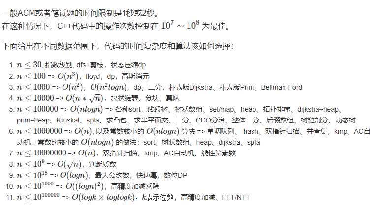

#### 由数据范围反推算法复杂度以及算法内容



#### 剑指 Offer II 004. 只出现一次的数字
给你一个整数数组 nums ，除某个元素仅出现 一次 外，其余每个元素都恰出现 三次 。请你找出并返回那个只出现了一次的元素。
示例 1：
输入：nums = [2,2,3,2]
输出：3
示例 2：
输入：nums = [0,1,0,1,0,1,100]
输出：100
1 <= nums.length <= 3 * 104
-231 <= nums[i] <= 231 - 1
nums 中，除某个元素仅出现 一次 外，其余每个元素都恰出现 三次
进阶：你的算法应该具有线性时间复杂度。 你可以不使用额外空间来实现吗？
* 不符合要求 空间复杂度O(N) 时间复杂度O(N）
```c++ 
class Solution {
public:
    int singleNumber(vector<int>& nums) {
        unordered_map<int, int> umap;
        int result = 0;
        for(int i = 0; i < nums.size(); i++) {
            umap[nums[i]]++;
        }
        for(auto &x : nums) {
            if (umap[x] == 1) result = x;
        }
        return result;
    }
};
```
```c++

class Solution {
public:
    int singleNumber(vector<int>& nums) {
        int ans = 0;
        for (int i = 0; i < 32; ++i) {
            int total = 0;
            for (int num: nums) {
                total += ((num >> i) & 1);
            }
            if (total % 3) {
                ans |= (1 << i);
            }
        }
        return ans;
    }
};
```
```c++
class Solution {
public:
    int singleNumber(vector<int>& nums) {
        int res = 0;
        for (int i = 0; i < 32; i++) { // 因为nums[i]是32位整数，
        // 所以针对每一位的对应二进制数值求和
            int sum = 0;
            for (int num : nums) {
                sum += ((num >> i) & 1); // 提取从右往左数第i位的数值，将所有nums[i]
                // 二进制下的第i位数值进行求和
            }
            if (sum % 3 == 1) { // 如果没办法被3整除，那么说明落单的那个数的第i位是1不是0
                res |= (1 << i);
            }
        }
        return res; // 输出结果
    }
};
```
```c++
class Solution {
public:
    int singleNumber(vector<int>& nums) {
        int res = 0;
        for (int i = 0; i < 32; i++) {
            int sum = 0;
            for (auto &num : nums) {
                sum += ((num >> i) & 1);
            }
            if (sum % 3) {
                res |= (1 << i);
            }
        }
        return res;
    }
};
```
### 剑指 Offer II 005. 单词长度的最大乘积
给定一个字符串数组 words，请计算当两个字符串 words[i] 和 words[j] 不包含相同字符时，它们长度的乘积的最大值。假设字符串中只包含英语的小写字母。如果没有不包含相同字符的一对字符串，返回 0。

示例 1:

输入: words = ["abcw","baz","foo","bar","fxyz","abcdef"]
输出: 16
解释: 这两个单词为 "abcw", "fxyz"。它们不包含相同字符，且长度的乘积最大。
```c++
class Solution {
public:
    int maxProduct(vector<string>& words) {
        int length = words.size();
        vector<int> masks(length);
        for (int i = 0; i < length; i++) {
            string word = words[i];
            int wordLength = word.size();
            for (int j = 0; j < wordLength; j++) {
                masks[i] |= 1 << (word[j] - 'a');
            }
        }
        int maxProd = 0;
        for (int i = 0; i < length; i++) {
            for (int j = i + 1; j < length; j++) {
                if ((masks[i] & masks[j]) == 0) {
                    maxProd = max(maxProd, int(words[i].size() * words[j].size()));
                }
            }
        }
        return maxProd;
    }
};
```
```c++
class Solution {
public:
    int maxProduct(vector<string>& words) {
        
    }
};
```
#### 剑指 Offer II 008. 和大于等于 target 的最短子数组
给定一个含有 n 个正整数的数组和一个正整数 target 。
找出该数组中满足其和 ≥ target 的长度最小的 连续子数组 [numsl, numsl+1, ..., numsr-1, numsr] ，并返回其长度。如果不存在符合条件的子数组，返回 0 。

示例 1：
输入：target = 7, nums = [2,3,1,2,4,3]
输出：2
解释：子数组 [4,3] 是该条件下的长度最小的子数组。
```c++
class Solution {
public:
    int minSubArrayLen(int target, vector<int>& nums) {
        int sum = 0;
        int minValue = INT_MAX;
        int subLength = 0;
        for (int i = 0, j = 0; i < nums.size(); i++) {
            sum += nums[i];
            while(sum >= target) {
                subLength = i - j + 1;
                sum -= nums[j++];
                minValue = min(subLength,minValue)
            }
        }
        return minValue;
    }
};
```