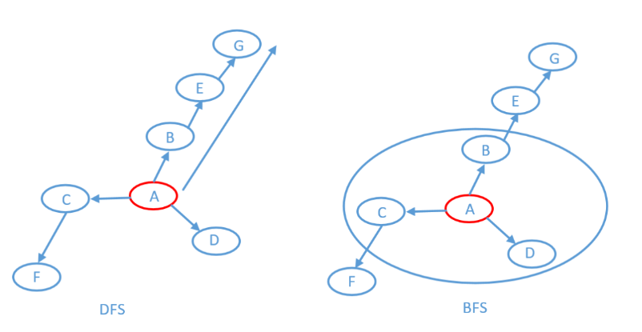

#### 200. 岛屿数量
给你一个由 '1'（陆地）和 '0'（水）组成的的二维网格，请你计算网格中岛屿的数量。
岛屿总是被水包围，并且每座岛屿只能由水平方向和/或竖直方向上相邻的陆地连接形成。
此外，你可以假设该网格的四条边均被水包围。
示例 1：
输入：grid = [
["1","1","1","1","0"],
["1","1","0","1","0"],
["1","1","0","0","0"],
["0","0","0","0","0"]
]
输出：1
* 这种写法比较好理解和记忆
```c++
class Solution {
    void dfs(vector<vector<char>>& grid, int i, int j) {
        int m = grid.size(), n = grid[0].size();
        if (i < 0 || j < 0 | i >= m || j >=n){
            return ;
        }
        if (grid[i][j] == '0') {
            return ;
        }

        grid[i][j] = '0';
        dfs(grid, i + 1, j);
        dfs(grid, i, j + 1);
        dfs(grid, i - 1, j);
        dfs(grid, i, j - 1);
    }
public:
    int numIslands(vector<vector<char>>& grid) {
        int res = 0;
        int m = grid.size(), n = grid[0].size();

        for (int i = 0; i < m; i++) {
            for (int j = 0; j < n; j++) {
                if (grid[i][j] == '1') {
                    res ++;
                    dfs(grid, i, j);
                }
            }
        }
        return res;      
    }
};
```
*DFS 不修改原数组
```c++
class Solution {
    void dfs(vector<vector<char>>& grid, vector<vector<bool>> &visited, int i, int j) {
        int m = grid.size(), n = grid[0].size();
        if(i < 0 || j < 0|| i >= m || j >= n || grid[i][j]=='0'|| visited[i][j] == true) return;
        visited[i][j] = true;
        dfs(grid, visited, i + 1, j);
        dfs(grid, visited, i - 1, j);
        dfs(grid, visited, i, j + 1);
        dfs(grid, visited, i, j - 1);
    }
public:
    int numIslands(vector<vector<char>>& grid) {
       int m = grid.size(), n = grid[0].size();
       vector<vector<bool>>visited(m, vector<bool>(n, false));
       int res = 0;
       for(int i = 0; i < m; i++) {
           for(int j = 0; j < n; j++) {
               if(grid[i][j] == '1' && visited[i][j] == false) {
                   dfs(grid, visited, i, j);
                   res++;
               }
           }
       }  
       return res;
    }
};
```
* BFS
```c++
class Solution {
public:
    int numIslands(vector<vector<char>>& grid) {
        int m = grid.size();
        int n = grid[0].size();
        vector<vector<bool>>visited(m, vector<bool>(n, false));
        int ans = 0;
        for(int i = 0; i < m; i++){
            for(int j = 0; j < n; j++){
                if(grid[i][j] == '1' && visited[i][j] == false){
                    bfs(grid, visited, i, j);
                    ans++;
                }
                visited[i][j] = true;
            }
        }
        return ans;
    }
    void bfs(vector<vector<char>>& grid, vector<vector<bool>>& visited, int i, int j){
        int m = grid.size();
        int n = grid[0].size();
        queue<pair<int, int>>que;
        que.push({i, j});
        while(!que.empty()){
            i = que.front().first;
            j = que.front().second;
            que.pop();
            visited[i][j] = true;
            if(i+1 < m && grid[i+1][j] == '1' && visited[i+1][j] == false){
                que.push({i + 1, j});
                visited[i + 1][j] = true;
            }
            if(j+1 < n && grid[i][j+1] == '1' && visited[i][j+1] == false){
                que.push({i, j + 1});
                visited[i][j + 1] = true;
            }
            if(i-1 >=0 && grid[i-1][j] == '1' && visited[i-1][j] == false){
                que.push({i - 1, j});
                visited[i - 1][j] = true;
            }
            if(j-1 >=0 && grid[i][j-1] == '1' && visited[i][j-1] == false){
                que.push({i, j - 1});
                visited[i][j - 1] = true;
            }
        }
    }
};
```
```c++
class Solution {
public:
    int numIslands(vector<vector<char>>& grid) {
        int nr = grid.size();
        if (!nr) return 0;
        int nc = grid[0].size();

        int num_islands = 0;
        for (int r = 0; r < nr; ++r) {
            for (int c = 0; c < nc; ++c) {
                if (grid[r][c] == '1') {
                    ++num_islands;
                    grid[r][c] = '0';
                    queue<pair<int, int>> neighbors;
                    neighbors.push({r, c});
                    while (!neighbors.empty()) {
                        auto rc = neighbors.front();
                        neighbors.pop();
                        int row = rc.first, col = rc.second;
                        if (row - 1 >= 0 && grid[row-1][col] == '1') {
                            neighbors.push({row-1, col});
                            grid[row-1][col] = '0';
                        }
                        if (row + 1 < nr && grid[row+1][col] == '1') {
                            neighbors.push({row+1, col});
                            grid[row+1][col] = '0';
                        }
                        if (col - 1 >= 0 && grid[row][col-1] == '1') {
                            neighbors.push({row, col-1});
                            grid[row][col-1] = '0';
                        }
                        if (col + 1 < nc && grid[row][col+1] == '1') {
                            neighbors.push({row, col+1});
                            grid[row][col+1] = '0';
                        }
                    }
                }
            }
        }

        return num_islands;
    }
};
class Solution {
private:
    const int cul[4][2]={{0,1},{0,-1},{-1,0},{1,0}};//用于计算当前陆地的上下左右坐标

public:
    int numIslands(vector<vector<char>>& grid) {
        int ans=0;  //记录岛屿数量        
        vector<vector<int>> vis(grid.size(),vector<int>(grid[0].size(),0)); //vis值记录遍历过的坐标
        queue<pair<int,int>> search;

        
        for(int i=0;i<grid.size();i++){        //全部遍历一遍
            for(int j=0;j<grid[0].size();j++){

                
                if(grid[i][j]=='1'&&vis[i][j]==0){          //符合条件的进行bfs
                    vis[i][j]=1;    //遍历过置vis值为1
                    search.push({i,j});

                              
                    /*********************关键代码***********************/    
                    /*广度优先搜索，用于标记陆地*/            
                    while(!search.empty()){
                        pair<int,int> loc=search.front();//拿出队列第一个坐标值
                        search.pop();
                        for(int m=0;m<4;m++){   //计算当前岛屿的上下左右坐标
                            if(loc.first+cul[m][0]<grid.size()&&loc.first+cul[m][0]>=0&&loc.second+cul[m][1]<grid[0].size()&&loc.second+cul[m][1]>=0){//判断边界
                            
                            //判断陆地是否遍历过，若遍历过说明已经标记不用再遍历一次
                            if(grid[loc.first+cul[m][0]][loc.second+cul[m][1]]=='1'&&vis[loc.first+cul[m][0]][loc.second+cul[m][1]]==0){
                                //符合条件将坐标位置推入队列，在下一轮对该位置的上下左右坐标是否有陆地进行判断
                                search.push({loc.first+cul[m][0],loc.second+cul[m][1]});
                                vis[loc.first+cul[m][0]][loc.second+cul[m][1]]=1;   //将遍历过的陆地的vis值置1
                            }

                            }
                        }
                    }
                    /************************************************/


                    ans++;  //一个岛屿遍历过的陆地vis值全部置1后，该岛屿被标记，最外层遍历不会再遍历到，ans++
                }


                vis[i][j]=1;    //非岛屿遍历过置vis值为1
            
            }
        }
        return ans;
    }
};


```
```c++
class Solution {
private:
    int dir[4][2] = {0, 1, 1, 0, -1, 0, 0, -1}; // 四个方向
    void dfs(vector<vector<char>>& grid, vector<vector<bool>>& visited, int x, int y) {
        for (int i = 0; i < 4; i++) {
            int nextx = x + dir[i][0];
            int nexty = y + dir[i][1];
            if (nextx < 0 || nextx >= grid.size() || nexty < 0 || nexty >= grid[0].size()) continue;  // 越界了，直接跳过
            if (!visited[nextx][nexty] && grid[nextx][nexty] == '1') { // 没有访问过的 同时 是陆地的

                visited[nextx][nexty] = true; 
                dfs(grid, visited, nextx, nexty);
            } 
        }
    }
public:
    int numIslands(vector<vector<char>>& grid) {
        int n = grid.size(), m = grid[0].size();
        vector<vector<bool>> visited = vector<vector<bool>>(n, vector<bool>(m, false)); 
        int result = 0;
        for (int i = 0; i < n; i++) {
            for (int j = 0; j < m; j++) {
                if (!visited[i][j] && grid[i][j] == '1') { 
                    result++; // 遇到没访问过的陆地，+1
                    dfs(grid, visited, i, j); // 将与其链接的陆地都标记上 true
                }
            }
        }
        return result;
    }
};
```

#### 695. 岛屿的最大面积
给你一个大小为 m x n 的二进制矩阵 grid 。
岛屿 是由一些相邻的 1 (代表土地) 构成的组合，这里的「相邻」要求两个 1 必须在 水平或者竖直的四个方向上 相邻。你可以假设 grid 的四个边缘都被 0（代表水）包围着。
岛屿的面积是岛上值为 1 的单元格的数目。
计算并返回 grid 中最大的岛屿面积。如果没有岛屿，则返回面积为 0 。
* DFS 修改原数组
```c++
class Solution {
    int dfs(vector<vector<int>>& grid, int i, int j) {
        int m = grid.size(), n = grid[0].size();
        if (i < 0 || j < 0 | i >= m || j >=n){
            return 0;
        }
        if (grid[i][j] == 0) {
            return 0;
        }

        grid[i][j] = 0;
        int count = 1;
        count += dfs(grid, i + 1, j);
        count += dfs(grid, i, j + 1);
        count += dfs(grid, i - 1, j);
        count += dfs(grid, i, j - 1);
        return count;
    }
   
public:
    int maxAreaOfIsland(vector<vector<int>>& grid) {
        int res = 0;
        int m = grid.size(), n = grid[0].size();

        for (int i = 0; i < m; i++) {
            for (int j = 0; j < n; j++) {
                if (grid[i][j] == 1) {
                    res = max(res, dfs(grid, i, j));
                }
            }
        }
        return res;   
    }
};
```
* DFS 不修改原数组
```c++
class Solution {
    int dfs(vector<vector<int>>& grid, vector<vector<bool>> &visited, int i , int j) {
        int m = grid.size(), n = grid[0].size();
        if(i < 0 || j < 0|| i >= m ||j >= n) return 0;
        if(grid[i][j] == 0) return 0;
        if(visited[i][j] == true) return 0;
        visited[i][j] = true;
        int count = 1;
        count += dfs (grid, visited, i + 1, j);
        count += dfs (grid, visited, i - 1, j);
        count += dfs (grid, visited, i, j + 1);
        count += dfs (grid, visited, i, j - 1);
        return count;
    }
public:
    int maxAreaOfIsland(vector<vector<int>>& grid) {
        int m = grid.size(), n = grid[0].size();
        vector<vector<bool>> visited(m, vector<bool>(n, false));
        int res = 0;
        for(int i = 0; i < m; i++) {
            for(int j = 0; j < n; j++) {
                if(grid[i][j] == 1 && visited[i][j] == false){
                    res = max(res, dfs(grid, visited, i, j));
                }
                visited[i][j] = true;
            }
        }
        return res;
    }
};
```
```c++
class Solution {
private:
    int count;
    int dir[4][2] = {0, 1, 1, 0, -1, 0, 0, -1}; // 四个方向
    void dfs(vector<vector<int>>& grid, vector<vector<bool>>& visited, int x, int y) {
        for (int i = 0; i < 4; i++) {
            int nextx = x + dir[i][0];
            int nexty = y + dir[i][1];
            if (nextx < 0 || nextx >= grid.size() || nexty < 0 || nexty >= grid[0].size()) continue;  // 越界了，直接跳过
            if (!visited[nextx][nexty] && grid[nextx][nexty] == 1) { // 没有访问过的 同时 是陆地的

                visited[nextx][nexty] = true;
                count++;
                dfs(grid, visited, nextx, nexty);
            }
        }
    }

public:
    int maxAreaOfIsland(vector<vector<int>>& grid) {
        int n = grid.size(), m = grid[0].size();
        vector<vector<bool>> visited = vector<vector<bool>>(n, vector<bool>(m, false));

        int result = 0;
        for (int i = 0; i < n; i++) {
            for (int j = 0; j < m; j++) {
                if (!visited[i][j] && grid[i][j] == 1) {
                    count = 1;
                    visited[i][j] = true;
                    dfs(grid, visited, i, j); // 将与其链接的陆地都标记上 true
                    result = max(result, count);
                }
            }
        }
        return result;
    }
};
```
#### 463. 岛屿的周长
给定一个 row x col 的二维网格地图 grid ，其中：grid[i][j] = 1 表示陆地， grid[i][j] = 0 表示水域。
网格中的格子 水平和垂直 方向相连（对角线方向不相连）。整个网格被水完全包围，但其中恰好有一个岛屿（或者说，一个或多个表示陆地的格子相连组成的岛屿）。
岛屿中没有“湖”（“湖” 指水域在岛屿内部且不和岛屿周围的水相连）。格子是边长为 1 的正方形。网格为长方形，且宽度和高度均不超过 100 。计算这个岛屿的周长。

示例 1：

输入：grid = [[0,1,0,0],[1,1,1,0],[0,1,0,0],[1,1,0,0]]
输出：16
解释：它的周长是上面图片中的 16 个黄色的边
```c++
class Solution {
    int dfs(vector<vector<int>>& grid, int i, int j) {
         int m = grid.size(), n = grid[0].size();
        if (i < 0 || j < 0 | i >= m || j >=n){
            return 1;
        }
        if (grid[i][j] == 0) {
            return 1;
        }
        if(grid[i][j] == 2) return 0;
        grid[i][j] = 2;
        return  dfs(grid, i + 1, j) + dfs(grid, i, j + 1) + dfs(grid, i - 1, j)+ dfs(grid, i, j - 1);
        
    }
public:
    int islandPerimeter(vector<vector<int>>& grid) {
        
        int m = grid.size(), n = grid[0].size();

        for (int i = 0; i < m; i++) {
            for (int j = 0; j < n; j++) {
                if (grid[i][j] == 1) {
                    return dfs(grid, i, j);
                }
            }
        }
        return 0;   
    }
};
```
```c++
class Solution {
    int dfs(vector<vector<int>>& grid, vector<vector<bool>>& visited, int i, int j) {
        int m = grid.size(), n = grid[0].size();
        if(i < 0 || j < 0 || i >= m|| j >= n) return 1;
        if(grid[i][j] == 0) return 1;
        if(visited[i][j] == true) return 0;
        visited[i][j] = true;
        return dfs(grid, visited, i + 1, j) + dfs(grid, visited, i - 1, j) + dfs(grid, visited, i, j - 1) + dfs(grid, visited, i, j + 1);
    }
public:
    int islandPerimeter(vector<vector<int>>& grid) {
        int m = grid.size(), n = grid[0].size();
        vector<vector<bool>> visited(m, vector<bool>(n, false));
        for(int i = 0; i < m; i++) {
            for(int j = 0; j < n ; j++) {
                if(grid[i][j] == 1 && visited[i][j] == false) {
                    return dfs(grid, visited, i, j);
                }
            }
        }
        return 0;
    }
};
```
```c++
class Solution {
public:
    int direction[4][2] = {0, 1, 1, 0, -1, 0, 0, -1};
    int islandPerimeter(vector<vector<int>>& grid) {
        int result = 0;
        for (int i = 0; i < grid.size(); i++) {
            for (int j = 0; j < grid[0].size(); j++) {
                if (grid[i][j] == 1) {
                    for (int k = 0; k < 4; k++) {       // 上下左右四个方向
                        int x = i + direction[k][0];
                        int y = j + direction[k][1];    // 计算周边坐标x,y
                        if (x < 0                       // i在边界上
                                || x >= grid.size()     // i在边界上
                                || y < 0                // j在边界上
                                || y >= grid[0].size()  // j在边界上
                                || grid[x][y] == 0) {   // x,y位置是水域
                            result++;
                        }
                    }
                }
            }
        }
        return result;
    }
};
```
#### 797. 所有可能的路径
给你一个有 n 个节点的 有向无环图（DAG），请你找出所有从节点 0 到节点 n-1 的路径并输出（不要求按特定顺序）
graph[i] 是一个从节点 i 可以访问的所有节点的列表（即从节点 i 到节点 graph[i][j]存在一条有向边）。
* DFS & 回溯
```c++
class Solution {
private:
    vector<vector<int>> result; // 收集符合条件的路径
    vector<int> path; // 0节点到终点的路径
    // x：目前遍历的节点
    // graph：存当前的图
    void dfs (vector<vector<int>>& graph, int x) {
        // 要求从节点 0 到节点 n-1 的路径并输出，所以是 graph.size() - 1
        if (x == graph.size() - 1) { // 找到符合条件的一条路径
            result.push_back(path);
            return;
        }
        for (int i = 0; i < graph[x].size(); i++) { // 遍历节点n链接的所有节点
            path.push_back(graph[x][i]); // 遍历到的节点加入到路径中来
            dfs(graph, graph[x][i]); // 进入下一层递归
            path.pop_back(); // 回溯，撤销本节点
        }
    }
public:
    vector<vector<int>> allPathsSourceTarget(vector<vector<int>>& graph) {
        path.push_back(0); // 无论什么路径已经是从0节点出发
        dfs(graph, 0); // 开始遍历
        return result;
    }
};
```
* BFS
```c++
class Solution {
public:
    vector<vector<int>> ans;
    vector<vector<int>> allPathsSourceTarget(vector<vector<int>>& graph) {
        queue<vector<int>> q;
        vector<int> v;
        v.push_back(0);
        q.push(v);
        while(!q.empty()){
            int size = q.size();
            for(int i =0; i < size; i++){
                vector<int> cur = q.front();
                q.pop();
                int id = cur[cur.size() - 1];
                if(id == graph.size() - 1){
                    ans.push_back(cur);
                    continue;
                }
                for(int next : graph[id]){
                    vector<int> tmp = cur;
                    tmp.push_back(next);
                    q.push(tmp);
                }
            }
        }
        return ans;
    }
};
```
```c++
class Solution {
    vector<int> path;
    vector<vector<int>> result;
    void dfs(vector<vector<int>>& graph, int x) {
        if(x == graph.size() - 1) {
            result.push_back(path);
            return ;
        }
        for(int i = 0; i < graph[x].size(); i++) {
            path.push_back(graph[x][i]);
            dfs(graph, graph[x][i]);
            path.pop_back();
        }
    }
public:
    vector<vector<int>> allPathsSourceTarget(vector<vector<int>>& graph) {
        path.clear();
        result.clear();
        path.push_back(0);
        dfs(graph, 0);
        return result;
    }
};
```
#### 542. 01 矩阵
给定一个由 0 和 1 组成的矩阵 mat ，请输出一个大小相同的矩阵，其中每一个格子是 mat 中对应位置元素到最近的 0 的距离。
两个相邻元素间的距离为 1 。
示例 1：

输入：mat = [[0,0,0],[0,1,0],[0,0,0]]
输出：[[0,0,0],[0,1,0],[0,0,0]]
示例 2：

输入：mat = [[0,0,0],[0,1,0],[1,1,1]]
输出：[[0,0,0],[0,1,0],[1,2,1]]
```c++
class Solution {
public:
    vector<vector<int>> updateMatrix(vector<vector<int>>& mat) {

    }
};  
```
```c++
class Solution {
public:
    vector<vector<int>> updateMatrix(vector<vector<int>>& mat) {
        int m=mat.size(),n=mat[0].size();
        queue<pair<int,int>>que;
        vector<vector<int>>direction{{-1,0},{1,0},{0,-1},{0,1}};//定义四个方向
        for(int i=0;i<m;++i){//将所有的0放入队列
            for(int j=0;j<n;++j){
                if(mat[i][j]==0){
                    que.push(make_pair(i,j));
                }else {
                    mat[i][j]=-1;//将所有的1设置为-1
                }
            }
        }

        int level=1;//类似于二叉树中的第几层
     //这里的层数不要被矩阵限制住了思维，所有的0都是第一层，被赋值过的元素是第二层，接着是第三层，第n层。。。   一层一层的剥洋葱   直至把矩阵的元素都遍历完
        while(!que.empty()){
            int size=que.size();
            while(size--){
                pair<int,int>cur=que.front();
                que.pop();
                for(int i=0;i<4;++i){//对四个方向进行遍历
                    int x=cur.first+direction[i][0];
                    int y=cur.second+direction[i][1];

                    if(x<0||x>=m||y<0||y>=n||mat[x][y]>=0){//对于大于等于0的数或越界进行跳过
                        continue;
                    }
                    mat[x][y]=level;//对于非0数进行赋值
                    que.push(make_pair(x,y));//开始生成新的洋葱皮
                }
            }
            ++level;
        }
        return mat;
    }
};

```
```c++
class Solution {
public:
    vector<vector<int>> updateMatrix(vector<vector<int>>& mat) {
        int m = mat.size(), n = mat[0].size();
        queue<pair<int, int>> que;
        vector<vector<int>> direction{{-1, 0}, {1, 0}, {0, -1}, {0, 1}};
        for(int i = 0; i < m; i++) {
            for(int j = 0; j < n; j++) {
                if(mat[i][j] == 0) {
                    que.push({i, j});
                } else {
                    mat[i][j] = -1;
                }
            }
        }
        while(!que.empty()) {
            auto cur = que.front();
            que.pop();
            for(int j = 0; j < 4; j++) {
                int x = cur.first + direction[j][0];
                int y = cur.second + direction[j][1];
                if(x < 0 || x >= m || y < 0 || y >= n || mat[x][y] >= 0) continue;
                mat[x][y] = mat[cur.first][cur.second] + 1;
                que.push({x, y});
            }  
        }
        return mat;
    }
};
```
#### 752. 打开转盘锁
你有一个带有四个圆形拨轮的转盘锁。每个拨轮都有10个数字： '0', '1', '2', '3', '4', '5', '6', '7', '8', '9' 。每个拨轮可以自由旋转：例如把 '9' 变为 '0'，'0' 变为 '9' 。每次旋转都只能旋转一个拨轮的一位数字。
锁的初始数字为 '0000' ，一个代表四个拨轮的数字的字符串。
列表 deadends 包含了一组死亡数字，一旦拨轮的数字和列表里的任何一个元素相同，这个锁将会被永久锁定，无法再被旋转。
字符串 target 代表可以解锁的数字，你需要给出解锁需要的最小旋转次数，如果无论如何不能解锁，返回 -1 。

示例 1:
输入：deadends = ["0201","0101","0102","1212","2002"], target = "0202"
输出：6
解释：
可能的移动序列为 "0000" -> "1000" -> "1100" -> "1200" -> "1201" -> "1202" -> "0202"。
注意 "0000" -> "0001" -> "0002" -> "0102" -> "0202" 这样的序列是不能解锁的，
因为当拨动到 "0102" 时这个锁就会被锁定。
```c++
class Solution {
public:
    int openLock(vector<string>& deadends, string target) {
        // 哈希表vis中存储不可能入队的结点，包括deadends和已访问过的结点
        unordered_set<string> vis;
        vis.insert(deadends.begin(), deadends.end()); 
        if(vis.count("0000")) 
            return -1;
        int step = 0;
        queue<string> st;
        st.push("0000");
        while(!st.empty()){            
            int length = st.size();
            for(int i = 0; i < length; i++){
                string curr = st.front();
                st.pop();
                // 找到目标元素，直接返回答案
                if(curr == target)
                    return step;
                // 处理curr周围的八个相邻结点
                for(int j = 0; j < 4; ++j){
                    // 自增1与自减1
                    for(int t = -1; t < 2; t += 2){
                        // 完美的字符处理方式，利用ascⅡ码之差之后加上t并取余作为新得到的整型，然后再加上0的ascⅡ码值返回字符
                        char a = (curr[j] -'0' + 10 + t) % 10 + '0';
                        string newOne = curr;
                        newOne[j] = a;
                        // 若哈希集中找不到此状态，则加入哈希集同时入队
                        if(!vis.count(newOne)){
                            st.push(newOne);
                            vis.emplace(newOne);
                        }
                    }                 
                }
            }
            // 本层队列中元素处理完成，到达下一转动步数，步数加1
            step++;
        }
        return -1;
    }
};
class Solution {
public:
    struct node{
        string status;
        int step;
    };
    int openLock(vector<string>& deadends, string target) {
        unordered_set<string> s;
        for(auto &str : deadends){
            s.insert(str);
        }
        //如果终点是起点，返回0
        if(target == "0000") return 0;
        //被0000卡住了，出发不了
        if(s.count("0000") == 1) return -1;
        queue<node> que;
        //将起点入队
        que.push((node){"0000",0});
        while(!que.empty()){
            //拿出队首元素并弹出
            node temp = que.front();
            que.pop();
            //找到目标返回步数
            if(temp.status == target){
                return temp.step;
            }
            for(int i = 0; i <= 4; i++){
                string t = temp.status;
                t[i]--;
                //<0改为9
                if(t[i] < '0') t[i] = '9';
                if(s.count(t) == 0){
                    que.push((node){t, temp.step + 1});
                    //插入到集合中，去重
                    s.insert(t);            
                }
                t = temp.status;
                t[i]++;
                //>9 改为0
                if(t[i] > '9') t[i] = '0';
                if(s.count(t) == 0){
                    que.push((node){t,temp.step + 1});
                    //插入到集合中，去重
                    s.insert(t);
                }
            }
        }
        return -1;
    }
};

```
```c++
class Solution {
public:
    int openLock(vector<string>& deadends, string target) {
        queue<string> q;
        unordered_map<string,int> deadends_hash;
        unordered_map<string,int> visit;
        for(string a:deadends){
            deadends_hash[a] = 1;
        }
        int step = 0;
        q.emplace("0000");

        while(q.size()){
            int sz = q.size();
            for(int i = 0;i<sz;i++){
                string this_string = q.front();
                q.pop();

                if(deadends_hash[this_string]){
                    continue;
                }

                if(this_string==target){
                    return step;
                }

                

                for(int j = 0;j<4;j++){
                    string a = plusone(this_string,j);
                    if(!visit[a]){
                        q.emplace(a);
                        visit[a]=1;
                    }
                    

                    a = minuone(this_string,j);
                    if(!visit[a]){
                        q.emplace(a);
                        visit[a]=1;
                    }
                }
            }
            step = step + 1;
        }
        return -1;

    }

    string plusone(string this_string, int j){
        if(this_string[j]=='9'){
            this_string[j] = '0';
        }else{
            this_string[j] = this_string[j] + 1;
        }
        return this_string;
    }

    string minuone(string this_string, int j){
        if(this_string[j]=='0'){
            this_string[j] = '9';
        }else{
            this_string[j] = this_string[j] - 1;
        }
        return this_string;
    }


};

class Solution {
public:
    int openLock(vector<string>& deadends, string target) {
        queue<pair<string, int>> q;
        unordered_map<string, bool> vis; // 记录数字是否访问过或为死亡数字
        for(auto& s: deadends)
            vis[s] = true;
        string s = "0000", ss;
        if(vis[s]) // 若初始数字为死亡数字，直接返回-1
            return -1;
        vis[s] = true; // 标记初始数字已访问
        q.emplace(s, 0); // 初始数字入队，旋转次数为0
        while(!q.empty()){
            auto [s, t] = q.front();
            q.pop();
            if(s == target) // 当前数字为目标数字，返回当前旋转次数
                return t;
            for(int i=0;i<4;i++){ // 遍历4位数字
                ss = s;
                ss[i] = ss[i]=='9' ? '0' : ss[i]+1; // 当前位+1
                if(!vis[ss]){ // 新数字未访问且不为死亡数字
                    vis[ss] = true; // 标记新数字已访问
                    q.emplace(ss, t+1); // 新数字入队，旋转次数+1
                }
                ss = s;
                ss[i] = ss[i]=='0' ? '9' : ss[i]-1; // 当前位-1
                if(!vis[ss]){ // 新数字未访问且不为死亡数字
                    vis[ss] = true; // 标记新数字已访问
                    q.emplace(ss, t+1); // 新数字入队，旋转次数+1
                }
            }
        }
        return -1; // 无法变为目标数字，直接返回-1
    }
};
class Solution {
public:
    int openLock(vector<string>& deadends, string target) {
        queue<pair<string, int>> process;
        process.push({"0000", 0});
        unordered_set<string> passby;
        passby.insert("0000");
        unordered_set<string> deadendset;
       
        for(const string& deadend : deadends){
            deadendset.insert(deadend);
        }
        if(deadendset.count("0000")){
            return -1;
        }
        if(target == "0000"){
            return 0;
        }

        while(!process.empty()){
            int levelsize = process.size();
            for(int i = 0; i < levelsize; i++){
                string cur_string = process.front().first;
                int steps = process.front().second;
                process.pop();
                for(int i = 0; i < 4; i++){
                    string forward_string = forward_rotation(cur_string , i);
                    if(forward_string == target){
                        return 1 + steps;
                    }
                    if(!deadendset.count(forward_string) && !passby.count(forward_string)){
                        process.push({forward_string, steps + 1});
                        passby.insert(forward_string);
                    }
                }
                for(int j = 0; j < 4; j++){
                    string backward_string = backward_rotation(cur_string, j);
                    if(backward_string == target){
                        return 1 + steps;
                    }
                    if(!deadendset.count(backward_string) && !passby.count(backward_string)){
                        process.push({backward_string, steps + 1});
                        passby.insert(backward_string);
                    }
                }
            }

        } 
        return -1;
    }

    string forward_rotation(string password, int i){
        if(i >= password.length()){
            cerr << "index beyond boundary" << endl;
            abort();
        }
        string res = password;
        if(res[i] != '9'){
            res[i] += 1;
        }else{
            res[i] = '0';
        }
        return res;
    }

    string backward_rotation(string password, int i){
        if(i >= password.length()){
            cerr << "index beyond boundary" << endl;
            abort();
        }
        string res = password;
        if(res[i] != '0'){
            res[i] -= 1;
        }else{
            res[i] = '9';
        }
        return res;
    }
};


```
```c++
class Solution {
public:
    int openLock(vector<string>& deadends, string target) {
        queue<pair<string, int>> q;
        unordered_map<string, bool> vis; // 记录数字是否访问过或为死亡数字
        for(auto& s: deadends)
            vis[s] = true;
        string s = "0000";
        if(vis[s]) // 若初始数字为死亡数字，直接返回-1
            return -1;
        vis[s] = true; // 标记初始数字已访问
        q.emplace(s, 0); // 初始数字入队，旋转次数为0
        while(!q.empty()){
            auto node = q.front();
            q.pop();
            if(node.first == target) // 当前数字为目标数字，返回当前旋转次数
                return node.second;
            for(int i = 0; i < 4; i++){ // 遍历4位数字
                auto temp = node.first;
                temp[i] = temp[i] == '9' ? '0' : temp[i] + 1; // 当前位+1
                if(!vis[temp]){ // 新数字未访问且不为死亡数字
                    vis[temp] = true; // 标记新数字已访问
                    q.emplace(temp, node.second + 1); // 新数字入队，旋转次数+1
                }
                temp = node.first;
                temp[i] = temp[i]=='0' ? '9' : temp[i] - 1; // 当前位-1
                if(!vis[temp]){ // 新数字未访问且不为死亡数字
                    vis[temp] = true; // 标记新数字已访问
                    q.emplace(temp, node.second + 1); // 新数字入队，旋转次数+1
                }
            }
        }
        return -1; // 无法变为目标数字，直接返回-1
    }
};
```
#### 399. 除法求值
给你一个变量对数组 equations 和一个实数值数组 values 作为已知条件，其中 equations[i] = [Ai, Bi] 和 values[i] 共同表示等式 Ai / Bi = values[i] 。每个 Ai 或 Bi 是一个表示单个变量的字符串。
另有一些以数组 queries 表示的问题，其中 queries[j] = [Cj, Dj] 表示第 j 个问题，请你根据已知条件找出 Cj / Dj = ? 的结果作为答案。
返回 所有问题的答案 。如果存在某个无法确定的答案，则用 -1.0 替代这个答案。如果问题中出现了给定的已知条件中没有出现的字符串，也需要用 -1.0 替代这个答案。
注意：输入总是有效的。你可以假设除法运算中不会出现除数为 0 的情况，且不存在任何矛盾的结果。

示例 1：

输入：equations = [["a","b"],["b","c"]], values = [2.0,3.0], queries = [["a","c"],["b","a"],["a","e"],["a","a"],["x","x"]]
输出：[6.00000,0.50000,-1.00000,1.00000,-1.00000]
解释：
条件：a / b = 2.0, b / c = 3.0
问题：a / c = ?, b / a = ?, a / e = ?, a / a = ?, x / x = ?
结果：[6.0, 0.5, -1.0, 1.0, -1.0 ]
```c++
class Solution {
public:
    double dfs(unordered_map<string, unordered_map<string, double>>& hash, string from,
                string to, unordered_set<string>& visited)
    {
        if (from == to)
        {
            return 1.0;
        }

        visited.insert(from);
        for (auto &path : hash[from])       //遍历哈希表，注意此处 path 是一个 pair 形式的 HashMap
        {
            string toStr = path.first;      // to 代表的字符串
            double curVal = path.second;    //从 from 到 to 的值

            if (visited.find(toStr) == visited.end())
            {
                double nextVal = dfs(hash, toStr, to, visited);
                if (nextVal > 0)
                {
                    return curVal * nextVal;
                }
            }
        }

        visited.erase(from);
        return -1.0;                        //返回负数表示无可达路径
    }

    vector<double> calcEquation(vector<vector<string>>& equations, vector<double>& values,
                                vector<vector<string>>& queries) {
        unordered_map<string, unordered_map<string, double>> hash;

        for (int i = 0; i < equations.size(); ++ i)                     //建图
        {
            hash[equations[i][0]][equations[i][1]] = values[i];         //从 from 到 to
            hash[equations[i][1]][equations[i][0]] = 1.0 / values[i];   //从 to 到 from
        }

        vector<double> res;

        for (int i = 0; i < queries.size(); ++ i)
        {
            string from = queries[i][0];
            string to = queries[i][1];

            if (hash.find(from) == hash.end() || hash.find(to) == hash.end())
            {
                res.push_back(-1);              //找不到终点或起点的情况，即不可达
            }
            else
            {
                unordered_set<string> visited;  //用一个哈希表记录走过的点
                res.push_back(dfs(hash, from, to ,visited));
            }
        }
        return res;
    }
};
class Solution {
public:
    //2020.12.7 日

    //全局变量2个
    vector<double> res;
    bool Nofand;

    void dfs(unordered_map< string , vector<pair<string,double>> >& g, unordered_map<string,int>& visit,string val, const string& target, const double& path){
        //如果节点已经相连接，那没 必要再dfs搜索了，直接返回
        if( Nofand == false )
            return;
        
        if( val == target){
            Nofand = false;
            res.push_back(path);
            return;
        }

        for(int j = 0;j<g[val].size(); ++j){
            //检查与val相连接的点，是否已经访问过了。没访问过继续dfs
            if(visit[ g[val][j].first ] == 0 ){
                visit[ g[val][j].first ] = 1;
                dfs( g,visit, g[val][j].first, target, path*g[val][j].second );
                visit[ g[val][j].first ] = 0;
            }
        }
    }

    vector<double> calcEquation(vector<vector<string>>& equations, vector<double>& values, vector<vector<string>>& queries) {

        //string - string(double)  a连接b(b带上权值)
        unordered_map< string , vector<pair<string,double>> > g;
        unordered_map<string,int> visit;

        //构建无向图，a-b的value是3 的话 ，b-a是3的倒数
        for(int i =0;i<equations.size();++i){
            g[equations[i][0]].push_back( make_pair(equations[i][1], values[i] ) );
            g[equations[i][1]].push_back( make_pair(equations[i][0], 1.0/values[i] ) );
        }

        //遍历queries，对每一组进行dfs计算结果。
        //如果相连接，就把 路径上的权值相乘就是结果

        for(int i =0; i<queries.size();++i){
            
            //如果queries[0]是不存在的，直接出结果：-1
            if( g.find(queries[i][0]) == g.end() ){
                res.push_back(-1.0);
                continue;
            }
                
            //设置一个全局变量，如果进行dfs后，queries[0]到不了queries[1]，Nofind = true;
            Nofand = true;

            visit[queries[i][0]]=1;
            dfs(g,visit,queries[i][0],queries[i][1],1);
            visit[queries[i][0]]=0;

            if( Nofand )
            res.push_back(-1.0);
        }

        return res;
    }
};

```
* BFS
```c++
class Solution {
public:
    unordered_map<string, vector<pair<string, double>>> edges;
    double BFS(string start,string end) {
        if (edges.find(start) == edges.end() || edges.find(end) == edges.end())return (double)-1;
        queue<pair<string, double>> que;//BFS需要队列
        unordered_set<string> used;//记录遍历过的点
        que.push({ start,1 });//放入起始点
        used.insert(start);//记录
        while (!que.empty()) {
            string curNode = que.front().first;
            double curRes = que.front().second;
            if (curNode == end) return curRes;//找到直接返回
            que.pop();
            if (edges.find(curNode) == edges.end())continue;
            for (int i = 0; i < edges[curNode].size(); i++) {//遍历邻接点
                string newNode = edges[curNode][i].first;
                double newRes = curRes * edges[curNode][i].second;//计算下一个点的结果
                if (used.find(newNode) != used.end())continue;
                used.insert(newNode);//标记已使用
                que.push({ newNode,newRes });//入队继续遍历
            }
        }
        return (double)-1;//没找到返回-1
    }
    vector<double> calcEquation(vector<vector<string>>& equations, vector<double>& values, vector<vector<string>>& queries) {
        vector<double> res;
        for (int i = 0; i < equations.size(); i++) {//建图
            edges[equations[i][0]].push_back({ equations[i][1],values[i] });
            edges[equations[i][1]].push_back({ equations[i][0],1.0 / values[i] });
        }
        for (int i = 0; i < queries.size(); i++) {//对每个公式计算结果
            res.push_back(BFS(queries[i][0], queries[i][1]));
        }
        return res;
    }
};
class Solution {
    unordered_map<string, unordered_map<string, double>> edges;
public:
    double dfs(string start, string end, unordered_set<string>& used)
    {
        if (start == end) return 1.0;
        used.insert(start);
        for (auto &path : edges[start]) {
            auto curNode = path.first;      // to 代表的字符串
            auto curVal = path.second;    //从 from 到 to 的值

            if (used.find(curNode) == used.end()) {
                auto newVal = dfs(curNode, end, used);
                if (newVal > 0) return curVal * newVal;
            }
        }
        used.erase(start);
        return -1.0;                        //返回负数表示无可达路径
    }

    vector<double> calcEquation(vector<vector<string>>& equations, vector<double>& values,
                                vector<vector<string>>& queries) {

        for (int i = 0; i < equations.size(); ++ i)  {       //建图
            edges[equations[i][0]][equations[i][1]] = values[i];         //从 from 到 to
            edges[equations[i][1]][equations[i][0]] = 1.0 / values[i];   //从 to 到 from
        }
        vector<double> res;
        for (int i = 0; i < queries.size(); ++ i) {
            string from = queries[i][0];
            string to = queries[i][1];
            if (edges.find(from) == edges.end() || edges.find(to) == edges.end()) res.push_back(-1);              //找不到终点或起点的情况，即不可达
            else {
                unordered_set<string> used;  //用一个哈希表记录走过的点
                res.push_back(dfs(from, to ,used));
            }
        }
        return res;
    }
};
```
#### 329. 矩阵中的最长递增路径
给定一个 m x n 整数矩阵 matrix ，找出其中 最长递增路径 的长度。
对于每个单元格，你可以往上，下，左，右四个方向移动。 你 不能 在 对角线 方向上移动或移动到 边界外（即不允许环绕）。
示例 1：

输入：matrix = [[9,9,4],[6,6,8],[2,1,1]]
输出：4
解释：最长递增路径为 [1, 2, 6, 9]。
```c++
class Solution {
public:
    int dfs(vector<vector<int>>& memo, vector<vector<int>>& matrix, int i, int j) {
        if (memo[i][j] != 0)
            return memo[i][j];
        memo[i][j]++;
        if (i - 1 >= 0 && matrix[i - 1][j] > matrix[i][j])
            memo[i][j] = max(memo[i][j], dfs(memo, matrix, i - 1, j) + 1);
        if (i + 1 < matrix.size() && matrix[i + 1][j] > matrix[i][j])
            memo[i][j] = max(memo[i][j], dfs(memo, matrix, i + 1, j) + 1);
        if (j - 1 >= 0 && matrix[i][j - 1] > matrix[i][j])
            memo[i][j] = max(memo[i][j], dfs(memo, matrix, i, j - 1) + 1);
        if (j + 1 < matrix[0].size() && matrix[i][j + 1] > matrix[i][j])
            memo[i][j] = max(memo[i][j], dfs(memo, matrix, i, j + 1) + 1);
        return memo[i][j];
    }
    int longestIncreasingPath(vector<vector<int>>& matrix) {
        if (matrix.size() == 0)
            return 0;
        int ans = 0;
        vector<vector<int>> memo(matrix.size(), vector<int>(matrix[0].size(), 0));
        for (int i = 0; i < matrix.size(); i++)
            for (int j = 0; j < matrix[i].size(); j++)
                ans = max(ans, dfs(memo, matrix, i, j));
        return ans;
    }
};

```
```c++
class Solution {
public:
    int n, m;
    vector<vector<int>> g;
    int dx[4] = {0, 1, 0, -1};
    int dy[4] = {1, 0, -1, 0};
    int dfs(int x, int y, vector<vector<int>>& f){
        if(f[x][y] != 0) return f[x][y];
        int res = 1;
        for(int i=0; i<4; i++){
            int a = x + dx[i];
            int b = y + dy[i];
            if(a >=0 && a < n && b >= 0 && b < m && g[a][b] > g[x][y]){
                res = max(res, dfs(a, b, f)+1);
            }
        }
        f[x][y] = res;
        return res;
    }
    int longestIncreasingPath(vector<vector<int>>& matrix) {
        n = matrix.size();
        m = matrix[0].size();
        vector<vector<int>> f(n, vector<int>(m, 0));
        g = matrix;
        int res = 1;
        for(int i=0; i<n; i++){
            for(int j=0; j<m; j++){
                res = max(res, dfs(i, j, f));
            }
        }
        return res;
    }
};
 int dfs(vector<vector<int>>& matrix, vector<vector<int>>& lengths, int i, int j)
    {
        if (lengths[i][j] != 0)
        {
            return lengths[i][j];   //当前节点已计算过，直接返回其值，避免重复计算
        }

        vector<pair<int, int>> dirs = {{1, 0}, {-1, 0}, {0, 1}, {0, -1}};
        int length = 1;             //长度初始为1，即当前一个节点

        for (pair<int, int> dir : dirs)
        {
            int x = i + dir.first;
            int y = j + dir.second;

            if (x >= 0 && x < matrix.size() && y >= 0 && y < matrix[0].size() && matrix[x][y] > matrix[i][j])
            {
                // +1 表示包含当前点的长度
                length = max(length, dfs(matrix, lengths, x, y) + 1);
            }
        }

        lengths[i][j] = length;     //记录该点的最长路径
        return length;
    }

    int longestIncreasingPath(vector<vector<int>>& matrix) {
        vector<vector<int>> lengths(matrix.size(), vector<int>(matrix[0].size()));

        int longest = 0;
        for (int i = 0; i < matrix.size(); ++ i)
        {
            for (int j = 0; j < matrix[0].size(); ++ j)
            {
                longest = max(longest, dfs(matrix, lengths, i, j));
            }
        }

        return longest;
    }
};


```
```c++
class Solution {
public:
    int result=-1;  //用result存储最长路径长度
    int longestIncreasingPath(vector<vector<int>>& matrix) {
        vector<vector<int>> book(matrix.size(),vector<int>(matrix[0].size(),-1));  //book记录矩阵中每个位置，以该位置为起点时，最长递增路径的长度，初始值设为-1
        for(int i=0;i<matrix.size();i++) //遍历矩阵
        {
            for(int j=0;j<matrix[0].size();j++)
            {
                if(book[i][j]==-1) //book值为-1说明之前未搜索过该点，需要进行搜索
                {
                    int maxValue=dfs(matrix,i,j,-1,book);
                    result=max(maxValue,result);
                }
                else{
                    result=max(book[i][j],result); //如果之前搜索过，book中会记录以该点为起点的最长路径长度，此时直接返回该值，无需进行搜索
                }
            }
        }
        return result;
    }

    int dfs(vector<vector<int>> &matrix,int i,int j,int pre,vector<vector<int>> &book)//传入参数如所示，其中要注意matrix要传引用，不然每次递归都会复制一个新的矩阵，很耗费时间，之前一直超时就是因为没传引用
    {
        if(i<0||i>=matrix.size()||j<0||j>=matrix[0].size()) return 0; //越界则返回0
        if(matrix[i][j]<=pre) return 0; //不为递增的方向也返回0
        if(book[i][j]!=-1) return book[i][j]; //如果之前访问过，book有记录，直接返回book值

        int a=dfs(matrix,i+1,j,matrix[i][j],book);
        int b=dfs(matrix,i-1,j,matrix[i][j],book);
        int c=dfs(matrix,i,j+1,matrix[i][j],book);
        int d=dfs(matrix,i,j-1,matrix[i][j],book); //对每个点的四个方向进行搜索，取四个方向中的最长值，+1后为该点的最长路径长度，在book中进行记录，同时返回该值

        int tmp1=max(a,b);
        int tmp2=max(c,d);
        book[i][j]=max(tmp1,tmp2)+1;
        return book[i][j];
    }
};

```
#### 210. 课程表 II * BFS 拓扑排序
现在你总共有 numCourses 门课需要选，记为 0 到 numCourses - 1。给你一个数组 prerequisites ，其中 prerequisites[i] = [ai, bi] ，表示在选修课程 ai 前 必须 先选修 bi 。
例如，想要学习课程 0 ，你需要先完成课程 1 ，我们用一个匹配来表示：[0,1] 。
返回你为了学完所有课程所安排的学习顺序。可能会有多个正确的顺序，你只要返回 任意一种 就可以了。如果不可能完成所有课程，返回 一个空数组 。
示例 1：

输入：numCourses = 2, prerequisites = [[1,0]]
输出：[0,1]
解释：总共有 2 门课程。要学习课程 1，你需要先完成课程 0。因此，正确的课程顺序为 [0,1] 。
```c++
class Solution {
public:
    vector<int> findOrder(int numCourses, vector<vector<int>>& prerequisites) {
        vector<vector<int>> graph(numCourses);
        vector<int> indegree(numCourses);
        vector<int> ans;
        // 建图
        for (int i = prerequisites.size() - 1; i >= 0; i--) {
            // v[1] -> v[0]
            indegree[prerequisites[i][0]]++;
            graph[prerequisites[i][1]].push_back(prerequisites[i][0]);
        }
        // 拓扑排序
        int remainNode = numCourses;
        queue<int> q;
        for (int i = 0; i < numCourses; i++) {
            if (!indegree[i]) {
                remainNode--;
                q.push(i);
                ans.push_back(i);
            }
        }
        while (q.size()) {
            int thisNode = q.front();
            q.pop();
            for (int& toNode : graph[thisNode]) {
                indegree[toNode]--;
                if (!indegree[toNode]) {
                    remainNode--;
                    q.push(toNode);
                    ans.push_back(toNode);
                }
            }
        }

        if (remainNode) {
            return {};
        }
        else {
            return ans;
        }
    }
};

class Solution {
public:
    vector<int> findOrder(int numCourses, vector<vector<int>>& prerequisites) {
        // 每个课程的依赖数目
        unordered_map<int, int> inDegree;
        // 课程到其后继课程的映射
        unordered_map<int, vector<int>> adjust;
        for (auto item: prerequisites) {
            int to = item[0];
            int from = item[1];
            inDegree[to]++;
            adjust[from].push_back(to);
        }
     
        // 所有无依赖的课程 入度 = 0
        queue<int> que;
        for (int i = 0; i < numCourses; i++) {
            if (inDegree.find(i) == inDegree.end()) {
                que.push(i);
            }
        }

        vector<int> result;
        while (!que.empty()) {
            int curNode = que.front();
            que.pop();
            result.push_back(curNode);
            // 将该课程的所有后继课程的依赖数减一
            for (auto course: adjust[curNode]) {
                inDegree[course]--;
                // 当该课程的依赖数目为0时，则加入到队列中，并从有依赖的课程中移出
                if (inDegree[course] == 0) {
                    que.push(course);
                    inDegree.erase(course);
                }
            }
        }
        
        if (!inDegree.empty()) {
            result = {};
        }
        return result;
    }
};
```
#### 剑指 Offer II 115. 重建序列
给定一个长度为 n 的整数数组 nums ，其中 nums 是范围为 [1，n] 的整数的排列。还提供了一个 2D 整数数组 sequences ，其中 sequences[i] 是 nums 的子序列。
检查 nums 是否是唯一的最短 超序列 。最短 超序列 是 长度最短 的序列，并且所有序列 sequences[i] 都是它的子序列。对于给定的数组 sequences ，可能存在多个有效的 超序列 。

例如，对于 sequences = [[1,2],[1,3]] ，有两个最短的 超序列 ，[1,2,3] 和 [1,3,2] 。
而对于 sequences = [[1,2],[1,3],[1,2,3]] ，唯一可能的最短 超序列 是 [1,2,3] 。[1,2,3,4] 是可能的超序列，但不是最短的。
如果 nums 是序列的唯一最短 超序列 ，则返回 true ，否则返回 false 。
子序列 是一个可以通过从另一个序列中删除一些元素或不删除任何元素，而不改变其余元素的顺序的序列。
示例 1：

输入：nums = [1,2,3], sequences = [[1,2],[1,3]]
输出：false
解释：有两种可能的超序列：[1,2,3]和[1,3,2]。
序列 [1,2] 是[1,2,3]和[1,3,2]的子序列。
序列 [1,3] 是[1,2,3]和[1,3,2]的子序列。
因为 nums 不是唯一最短的超序列，所以返回false。
```c++
// 拓扑排序
class Solution {
public:
    bool sequenceReconstruction(vector<int>& nums, vector<vector<int>>& sequences) {
        int n = nums.size();
        vector<int> indegrees(n + 1);
        vector<unordered_set<int>> graph(n + 1);
        for (const auto& sequence : sequences) {
            for (int i = 0; i + 1 < sequence.size(); i++) {
                int u = sequence[i], v = sequence[i + 1];   // u -> v
                if (!graph[u].count(v)) {
                    graph[u].emplace(v);
                    ++indegrees[v];
                }
            }
        }
        queue<int> q;
        for (int i = 1; i <= n; i++) {
            if (!indegrees[i]) {
                q.emplace(i);
            }
        }
        if (q.size() != 1) return false;

        vector<int> seq;
        while (!q.empty()) {
            int u = q.front(); q.pop();
            seq.emplace_back(u);
            for (int v : graph[u]) {
                if (!--indegrees[v]) {
                    q.emplace(v);
                }
            }
            if (q.size() > 1) return false;
        }
        
        return seq == nums;
    }
};
```
#### 547. 省份数量 * DFS * BFS * 并查集
有 n 个城市，其中一些彼此相连，另一些没有相连。如果城市 a 与城市 b 直接相连，且城市 b 与城市 c 直接相连，那么城市 a 与城市 c 间接相连。
省份 是一组直接或间接相连的城市，组内不含其他没有相连的城市。
给你一个 n x n 的矩阵 isConnected ，其中 isConnected[i][j] = 1 表示第 i 个城市和第 j 个城市直接相连，而 isConnected[i][j] = 0 表示二者不直接相连。
返回矩阵中 省份 的数量。
```c++
class Solution {
public:
    int findCircleNum(vector<vector<int>>& isConnected) {
        
    }
};
```
