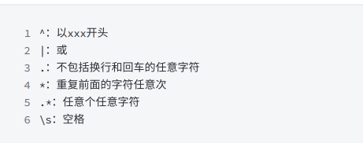

### 1873. 计算特殊奖金

```mysql
SELECT employee_id,
(CASE WHEN MOD(employee_id,2)!=0 AND LEFT(name,1)!='M' THEN salary
      WHEN MOD(employee_id,2)=0 OR LEFT(name,1)='M' THEN 0
      END) bonus
FROM Employees
ORDER BY employee_id
```

* MySQL IF 根据表达式的某个条件或值结果来执行一组 SQL 语句。
语法结构如下：
IF(expr,v1,v2)
其中：表达式 expr 得到不同的结果，当 expr 为真是返回 v1 的值，否则返回 v2.

* Mod(a,b) 在sql中的意思是 a / b 的余数 # 基础用法：如果id需要是偶数或者奇数时就可以使用mod。
mod(id,2)=1 是指id是奇数。
mod(id,2)=0 是指id是偶数。

```mysql
SELECT
employee_id,
IF(MOD(employee_id,2)!=0 AND LEFT(name,1)!='M',salary,0) bonus
FROM Employees
ORDER BY employee_id
```
CASE配合WHEN,THEN判断，LEFT和’=‘判断，MOD取余
CASE配合WHEN,THEN使用，WHEN后接条件，THEN后接符合条件返回的内容 ，有多个条件时使用
需要用ELSE返回以上条件都不成立时返回的内容，最后以END`结尾
```mysql
SELECT
employee_id,
CASE
WHEN MOD(employee_id,2)!=0 AND LEFT(name,1)!='M' THEN salary
WHEN MOD(employee_id,2)=0 OR LEFT(name,1)='M' THEN 0
ELSE 0 -- 这里ELSE可以省略
END AS bonus
FROM Employees
ORDER BY employee_id
```

### 627. 变更性别
```mysql
UPDATE salary
SET
    sex = CASE sex
        WHEN "m" THEN "f"
        ELSE "m"
    END;
```

### 196. 删除重复的电子邮箱
编写一个 SQL 删除语句来 删除 所有重复的电子邮件，只保留一个id最小的唯一电子邮件。 
* 从查询结果中DELETE
```mysql
DELETE p1.* FROM Person p1,
    Person p2
WHERE
    p1.Email = p2.Email AND p1.Id > p2.Id

```

### 1667. 修复表中的名字
编写一个 SQL 查询来修复名字，使得只有第一个字符是大写的，其余都是小写的。

返回按 user_id 排序的结果表。
```mysql
SELECT user_id,
    CONCAT(UPPER(LEFT(name, 1)), LOWER(SUBSTR(name, 2))) name
FROM Users
ORDER BY
    user_id
```
* CONCAT 用来拼接字符串 
* LEFT 从左边截取字符
* RIGHT 从右边截取字符
* UPPER 变为大写
* LOWER 变为小写
* LENGTH 获取字符串长度
* substr(string,pos,end)这个函数不填入end就是取pos位置及其之后所有的字符。

### 1484. 按日期分组销售产品
编写一个 SQL 查询来查找每个日期、销售的不同产品的数量及其名称。 DISTINCT去重
每个日期的销售产品名称应按词典序排列。
返回按sell_date 排序的结果表。
查询结果格式如下例所示。

```mysql
SELECT sell_date,
       COUNT(DISTINCT product) num_sold,
       GROUP_CONCAT(DISTINCT product) products
FROM Activities
GROUP BY sell_date
```
连接group by的结果集时，可以指定自定义的分隔符，不指定的情况下，默认是 ',' GROUP_CONCAT(DISTINCT product ORDER BY product ASC SEPARATOR ',')
### 1527. 患某种疾病的患者
写一条SQL 语句，查询患有 I 类糖尿病的患者ID （patient_id）、患者姓名（patient_name）以及其患有的所有疾病代码（conditions）。I 类糖尿病的代码总是包含前缀DIAB1。

```mysql
SELECT *
FROM Patients 
where conditions like 'DIAB1%' or conditions like '% DIAB1%'
```
转义字符 \b 表示单词的边界，即空白字符或文本的开头或结尾

```mysql
SELECT *
FROM Patients
WHERE conditions REGEXP '\\bDIAB1'
------------------------------------------------
SELECT * 
FROM Patients
WHERE conditions REGEXP '\\bDIAB1.*\\b'; 
```
```mysql
SELECT *
FROM Patients
WHERE conditions REGEXP ' DIAB1|^DIAB1';
```