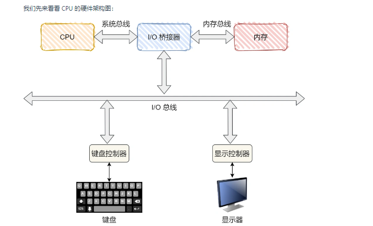

#### 为了屏蔽设备之间的差异，每个设备都有一个叫设备控制器（Device Control） 的组件，比如硬盘有硬盘控制器、显示器有视频控制器等。

#### 因为这些控制器都很清楚的知道对应设备的用法和功能，所以 CPU 是通过设备控制器来和设备打交道的。

设备控制器里有芯片，它可执行自己的逻辑，也有自己的寄存器，用来与 CPU 进行通信，比如：

通过写入这些寄存器，操作系统可以命令设备发送数据、接收数据、开启或关闭，或者执行某些其他操作。
通过读取这些寄存器，操作系统可以了解设备的状态，是否准备好接收一个新的命令等。
实际上，控制器是有三类寄存器，它们分别是状态寄存器（Status Register）、 命令寄存器（Command Register）以及数据寄存器（Data Register）
这三个寄存器的作用：

* 数据寄存器，CPU 向 I/O 设备写入需要传输的数据，比如要打印的内容是「Hello」，CPU 就要先发送一个 H 字符给到对应的 I/O 设备。
* 命令寄存器，CPU 发送一个命令，告诉 I/O 设备，要进行输入/输出操作，于是就会交给 I/O 设备去工作，任务完成后，会把状态寄存器里面的状态标记为完成。
* 状态寄存器，目的是告诉 CPU ，现在已经在工作或工作已经完成，如果已经在工作状态，CPU 再发送数据或者命令过来，都是没有用的，直到前面的工作已经完成，状态寄存标记成已完成，CPU 才能发送下一个字符和命令。
**CPU 通过读写设备控制器中的寄存器控制设备，这可比 CPU 直接控制输入输出设备，要方便和标准很多。**

#### 输入输出设备可分为两大类 ：块设备（Block Device）和字符设备（Character Device）。

* 块设备，把数据存储在固定大小的块中，每个块有自己的地址，硬盘、USB 是常见的块设备。
* 字符设备，以字符为单位发送或接收一个字符流，字符设备是不可寻址的，也没有任何寻道操作，鼠标是常见的字符设备。
* 块设备通常传输的数据量会非常大，于是控制器设立了一个可读写的数据缓冲区。

CPU 写入数据到控制器的缓冲区时，当缓冲区的数据囤够了一部分，才会发给设备。
CPU 从控制器的缓冲区读取数据时，也需要缓冲区囤够了一部分，才拷贝到内存。
**这样做是为了，减少对设备的频繁操作。**

#### 那 CPU 是如何与设备的控制寄存器和数据缓冲区进行通信的？存在两个方法：

端口 I/O，每个控制寄存器被分配一个 I/O 端口，可以通过特殊的汇编指令操作这些寄存器，比如 in/out 类似的指令。
内存映射 I/O，将所有控制寄存器映射到内存空间中，这样就可以像读写内存一样读写数据缓冲区。

### 键盘敲入字母时，期间发生了什么？
看完前面的内容，相信你对输入输出设备的管理有了一定的认识，那接下来就从操作系统的角度回答开头的问题「键盘敲入字母时，操作系统期间发生了什么？」

* CPU 里面的内存接口，直接和系统总线通信，然后系统总线再接入一个 I/O 桥接器，
* 这个 I/O 桥接器，另一边接入了内存总线，使得 CPU 和内存通信。
* 再另一边，又接入了一个 I/O 总线，用来连接 I/O 设备，比如键盘、显示器等。

那当用户输入了键盘字符，键盘控制器就会产生扫描码数据，并将其缓冲在键盘控制器的寄存器中，紧接着键盘控制器通过总线给 CPU 发送中断请求。
CPU 收到中断请求后，操作系统会保存被中断进程的 CPU 上下文，然后调用键盘的中断处理程序。

键盘的中断处理程序是在键盘驱动程序初始化时注册的
那键盘中断处理函数的功能就是从键盘控制器的寄存器的缓冲区读取扫描码，再根据扫描码找到用户在键盘输入的字符，
如果输入的字符是显示字符，那就会把扫描码翻译成对应显示字符的 ASCII 码，比如用户在键盘输入的是字母 A，是显示字符，于是就会把扫描码翻译成 A 字符的 ASCII 码。

得到了显示字符的 ASCII 码后，就会把 ASCII 码放到「读缓冲区队列」，接下来就是要把显示字符显示屏幕
**显示设备的驱动程序会定时从「读缓冲区队列」读取数据放到「写缓冲区队列」**
最后把「**写缓冲区队列」的数据一个一个写入到显示设备的控制器的寄存器中的数据缓冲区**，最后将这些数据显示在屏幕里。

显示出结果后，恢复被中断进程的上下文。

