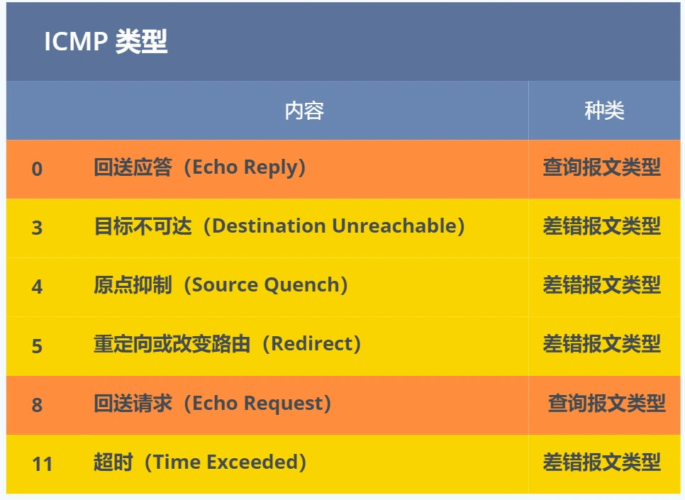

#### IP 在 TCP/IP 参考模型中处于第三层，也就是网络层。
* 网络层的主要作用是：实现主机与主机之间的通信，也叫点对点（end to end）通信。

##### 网络层与数据链路层有什么关系呢？

* IP 的作用是主机之间通信用的，而 MAC 的作用则是实现「直连」的两个设备之间通信，而 IP 则负责在「没有直连」的两个网络之间进行通信传输。
* 在网络中数据包传输中，源IP地址和目标IP地址在传输过程中是不会变化的（前提：没有使用 NAT 网络），只有源 MAC 地址和目标 MAC 一直在变化。

#### IP 地址的基础知识

IP 地址的分类
互联网诞生之初，IP 地址显得很充裕，于是计算机科学家们设计了分类地址。

IP 地址分类成了 5 种类型，分别是 A 类、B 类、C 类、D 类、E 类。

什么是 A、B、C 类地址？

其中对于 A、B、C 类主要分为两个部分，分别是网络号和主机号
A、B、C 分类地址最大主机个数是如何计算的呢？

最大主机个数，就是要看主机号的位数，如 C 类地址的主机号占 8 位，那么 C 类地址的最大主机个数：

因为在 IP 地址中，有两个 IP 是特殊的，分别是主机号全为 1 和 全为 0 地址。
主机号全为 1 指定某个网络下的所有主机，用于广播
主机号全为 0 指定某个网络
因此，在分配过程中，应该去掉这两种情况。

广播地址用于什么？

广播地址用于在同一个链路中相互连接的主机之间发送数据包。

学校班级中就有广播的例子，在准备上课的时候，通常班长会喊：“上课， 全体起立！”，班里的同学听到这句话是不是全部都站起来了？这个句话就有广播的含义。

当主机号全为 1 时，就表示该网络的广播地址。例如把 172.20.0.0/16 用二进制表示如下：

10101100.00010100.00000000.00000000

将这个地址的主机部分全部改为 1，则形成广播地址：

10101100.00010100.11111111.11111111

再将这个地址用十进制表示，则为 172.20.255.255。

广播地址可以分为本地广播和直接广播两种。

在本网络内广播的叫做本地广播。例如网络地址为 192.168.0.0/24 的情况下，广播地址是 192.168.0.255 。因为这个广播地址的 IP 包会被路由器屏蔽，所以不会到达 192.168.0.0/24 以外的其他链路上。
在不同网络之间的广播叫做直接广播。例如网络地址为 192.168.0.0/24 的主机向 192.168.1.255/24 的目标地址发送 IP 包。收到这个包的路由器，将数据转发给 192.168.1.0/24，从而使得所有 192.168.1.1~192.168.1.254 的主机都能收到这个包（由于直接广播有一定的安全问题，多数情况下会在路由器上设置为不转发。） 

什么是 D、E 类地址？

而 D 类和 E 类地址是没有主机号的，所以不可用于主机 IP，D 类常被用于多播，E 类是预留的分类，暂时未使用。
多播地址用于什么？

多播用于将包发送给特定组内的所有主机。

还是举班级的栗子，老师说：“最后一排的同学，上来做这道数学题。”，老师指定的是最后一排的同学，也就是多播的含义了。

由于广播无法穿透路由，若想给其他网段发送同样的包，就可以使用可以穿透路由的多播。

#### IP 分类的优点
* 不管是路由器还是主机解析到一个 IP 地址时候，我们判断其 IP 地址的首位是否为 0，为 0 则为 A 类地址，那么就能很快的找出网络地址和主机地址。
* 
#### IP 分类的缺点
* 同一网络下没有地址层次，比如一个公司里用了 B 类地址，但是可能需要根据生产环境、测试环境、开发环境来划分地址层次，而这种 IP 分类是没有地址层次划分的功能，所以这就缺少地址的灵活性。
* A、B、C类有个尴尬处境，就是不能很好的与现实网络匹配。

C 类地址能包含的最大主机数量实在太少了，只有 254 个，估计一个网吧都不够用。
而 B 类地址能包含的最大主机数量又太多了，6 万多台机器放在一个网络下面，一般的企业基本达不到这个规模，闲着的地址就是浪费。

这两个缺点，都可以在 CIDR 无分类地址解决。

#### 无分类地址 CIDR
正因为 IP 分类存在许多缺点，所以后面提出了无分类地址的方案，即 CIDR。

这种方式不再有分类地址的概念，32 比特的 IP 地址被划分为两部分，前面是网络号，后面是主机号。

#### 怎么划分网络号和主机号的呢？
还有另一种划分网络号与主机号形式，那就是子网掩码，掩码的意思就是掩盖掉主机号，剩余的就是网络号。

将子网掩码和 IP 地址按位计算 AND，就可得到网络号。

#### 为什么要分离网络号和主机号？

因为两台计算机要通讯，首先要判断是否处于同一个广播域内，即网络地址是否相同。如果网络地址相同，表明接受方在本网络上，那么可以把数据包直接发送到目标主机。

路由器寻址工作中，也就是通过这样的方式来找到对应的网络号的，进而把数据包转发给对应的网络内。

公有 IP 地址与私有 IP 地址
在 A、B、C 分类地址，实际上有分公有 IP 地址和私有 IP 地址。

#### 公有 IP 地址由谁管理呢？

私有 IP 地址通常是内部的 IT 人员管理，公有 IP 地址是由 **ICANN** 组织管理，中文叫**「互联网名称与数字地址分配机构」。**

IANA 是 ICANN 的其中一个机构，它负责分配互联网 IP 地址，是按州的方式层层分配。

#### 环回地址是不会流向网络

环回地址是在同一台计算机上的程序之间进行网络通信时所使用的一个默认地址。

计算机使用一个特殊的 IP 地址 127.0.0.1 作为环回地址。与该地址具有相同意义的是一个叫做 localhost 的主机名。使用这个 IP 或主机名时，数据包不会流向网络。

#IP 分片与重组

在分片传输中，一旦某个分片丢失，则会造成整个 IP 数据报作废，所以 TCP 引入了 MSS 也就是在 TCP 层进行分片不由 IP 层分片，那么对于 UDP 我们尽量不要发送一个大于 MTU 的数据报文。

Pv6 的亮点

IPv6 不仅仅只是可分配的地址变多了，它还有非常多的亮点。

IPv6 可自动配置，即使没有 DHCP 服务器也可以实现自动分配IP地址，即插即用
IPv6 包头包首部长度采用固定的值 40 字节，去掉了包头校验和，简化了首部结构，减轻了路由器负荷，大大提高了传输的性能。
IPv6 有应对伪造 IP 地址的网络安全功能以及防止线路窃听的功能，大大提升了安全性。
... （由你发现更多的亮点）
IPv6 地址的标识方法

#### IPv6 相比 IPv4 的首部改进：

* 取消了首部校验和字段。 因为在数据链路层和传输层都会校验，因此 IPv6 直接取消了 IP 的校验。
* 取消了分片/重新组装相关字段。 分片与重组是耗时的过程，IPv6 不允许在中间路由器进行分片与重组，这种操作只能在源与目标主机，这将大大提高了路由器转发的速度。
* 取消选项字段。 选项字段不再是标准 IP 首部的一部分了，但它并没有消失，而是可能出现在 IPv6 首部中的「下一个首部」指出的位置上。删除该选项字段使的 IPv6 的首部成为固定长度的 40 字节。

####  IP 协议相关技术
DNS
我们在上网的时候，通常使用的方式是域名，而不是 IP 地址，因为域名方便人类记忆。

那么实现这一技术的就是 DNS 域名解析，DNS 可以将域名网址自动转换为具体的 IP 地址。

域名的层级关系

DNS 中的域名都是用句点来分隔的，比如 www.server.com，这里的句点代表了不同层次之间的界限。

在域名中，越靠右的位置表示其层级越高。

毕竟域名是外国人发明，所以思维和中国人相反，比如说一个城市地点的时候，外国喜欢从小到大的方式顺序说起（如 XX 街道 XX 区 XX 市 XX 省），而中国则喜欢从大到小的顺序（如 XX 省 XX 市 XX 区 XX 街道）。

根域是在最顶层，它的下一层就是 com 顶级域，再下面是 server.com。

所以域名的层级关系类似一个树状结构：

根 DNS 服务器
顶级域 DNS 服务器（com）
权威 DNS 服务器（server.com）

#### 域名解析的工作流程

* 浏览器首先看一下自己的缓存里有没有，如果没有就向操作系统的缓存要，还没有就检查本机域名解析文件 hosts，如果还是没有，就会 DNS 服务器进行查询，查询的过程如下：

* 客户端首先会发出一个 DNS 请求，问 www.server.com 的 IP 是啥，并发给本地 DNS 服务器（也就是客户端的 TCP/IP 设置中填写的 DNS 服务器地址）。 
* 本地域名服务器收到客户端的请求后，如果缓存里的表格能找到 www.server.com，则它直接返回 IP 地址。如果没有，本地 DNS 会去问它的根域名服务器：“老大， 能告诉我 www.server.com 的 IP 地址吗？” 根域名服务器是最高层次的，它不直接用于域名解析，但能指明一条道路。 
* 根 DNS 收到来自本地 DNS 的请求后，发现后置是 .com，说：“www.server.com 这个域名归 .com 区域管理”，我给你 .com 顶级域名服务器地址给你，你去问问它吧。” 
* 本地 DNS 收到顶级域名服务器的地址后，发起请求问“老二， 你能告诉我 www.server.com 的 IP 地址吗？” 
* 顶级域名服务器说：“我给你负责 www.server.com 区域的权威 DNS 服务器的地址，你去问它应该能问到”。 
* 本地 DNS 于是转向问权威 DNS 服务器：“老三，www.server.com对应的IP是啥呀？” server.com 的权威 DNS 服务器，它是域名解析结果的原出处。为啥叫权威呢？就是我的域名我做主。 
* 权威 DNS 服务器查询后将对应的 IP 地址 X.X.X.X 告诉本地 DNS。
本地 DNS 再将 IP 地址返回客户端，客户端和目标建立连接。
至此，我们完成了 DNS 的解析过程。

#### ARP
在传输一个 IP 数据报的时候，确定了源 IP 地址和目标 IP 地址后，就会通过主机「路由表」确定 IP 数据包下一跳。然而，网络层的下一层是数据链路层，所以我们还要知道「下一跳」的 MAC 地址。

由于主机的路由表中可以找到下一跳的 IP 地址，所以可以通过 ARP 协议，求得下一跳的 MAC 地址。

#### 那么 ARP 又是如何知道对方 MAC 地址的呢？

ARP 是借助 ARP 请求与 ARP 响应两种类型的包确定 MAC 地址的。

* ARP 广播
主机会通过广播发送 ARP 请求，这个包中包含了想要知道的 MAC 地址的主机 IP 地址。
当同个链路中的所有设备收到 ARP 请求时，会去拆开 ARP 请求包里的内容，如果 ARP 请求包中的目标 IP 地址与自己的 IP 地址一致，那么这个设备就将自己的 MAC 地址塞入 ARP 响应包返回给主机。
操作系统通常会把第一次通过 ARP 获取的 MAC 地址缓存起来，以便下次直接从缓存中找到对应 IP 地址的 MAC 地址。
* 不过，MAC 地址的缓存是有一定期限的，超过这个期限，缓存的内容将被清除。
* 
#### RARP 协议你知道是什么吗？

ARP 协议是已知 IP 地址求 MAC 地址，那 RARP 协议正好相反，它是已知 MAC 地址求 IP 地址。
例如将打印机服务器等小型嵌入式设备接入到网络时就经常会用得到。

通常这需要架设一台 RARP 服务器，在这个服务器上注册设备的 MAC 地址及其 IP 地址。然后再将这个设备接入到网络，接着：

该设备会发送一条「我的 MAC 地址是XXXX，请告诉我，我的IP地址应该是什么」的请求信息。
RARP 服务器接到这个消息后返回「MAC地址为 XXXX 的设备，IP地址为 XXXX」的信息给这个设备。
最后，设备就根据从 RARP 服务器所收到的应答信息设置自己的 IP 地址。

#### DHCP
DHCP 在生活中我们是很常见的了，我们的电脑通常都是通过 DHCP 动态获取 IP 地址，大大省去了配 IP 信息繁琐的过程。

接下来，我们来看看我们的电脑是如何通过 4 个步骤的过程，获取到 IP 的。
先说明一点，DHCP 客户端进程监听的是 68 端口号，DHCP 服务端进程监听的是 67 端口号。

这 4 个步骤：

* 客户端首先发起 DHCP 发现报文（DHCP DISCOVER） 的 IP 数据报，由于客户端没有 IP 地址，也不知道 DHCP 服务器的地址，所以使用的是 UDP 广播通信，其使用的广播目的地址是 255.255.255.255（端口 67） 并且使用 0.0.0.0（端口 68） 作为源 IP 地址。DHCP 客户端将该 IP 数据报传递给链路层，链路层然后将帧广播到所有的网络中设备。
* DHCP 服务器收到 DHCP 发现报文时，用 DHCP 提供报文（DHCP OFFER） 向客户端做出响应。该报文仍然使用 IP 广播地址 255.255.255.255，该报文信息携带服务器提供可租约的 IP 地址、子网掩码、默认网关、DNS 服务器以及 IP 地址租用期。
* 客户端收到一个或多个服务器的 DHCP 提供报文后，从中选择一个服务器，并向选中的服务器发送 DHCP 请求报文（DHCP REQUEST进行响应，回显配置的参数。
* 最后，服务端用 DHCP ACK 报文对 DHCP 请求报文进行响应，应答所要求的参数。
* 一旦客户端收到 DHCP ACK 后，交互便完成了，并且客户端能够在租用期内使用 DHCP 服务器分配的 IP 地址。

如果租约的 DHCP IP 地址快期后，客户端会向服务器发送 DHCP 请求报文：
服务器如果同意继续租用，则用 DHCP ACK 报文进行应答，客户端就会延长租期。
服务器如果不同意继续租用，则用 DHCP NACK 报文，客户端就要停止使用租约的 IP 地址。
可以发现，DHCP 交互中，全程都是使用 UDP 广播通信。
咦，用的是广播，那如果 DHCP 服务器和客户端不是在同一个局域网内，路由器又不会转发广播包，那不是每个网络都要配一个 DHCP 服务器？
所以，为了解决这一问题，就出现了 DHCP 中继代理。有了 DHCP 中继代理以后，对不同网段的 IP 地址分配也可以由一个 DHCP 服务器统一进行管理。

#### DHCP 中继代理
DHCP 客户端会向 DHCP 中继代理发送 DHCP 请求包，而 DHCP 中继代理在收到这个广播包以后，再以单播的形式发给 DHCP 服务器。
服务器端收到该包以后再向 DHCP 中继代理返回应答，并由 DHCP 中继代理将此包广播给 DHCP 客户端 。
因此，DHCP 服务器即使不在同一个链路上也可以实现统一分配和管理IP地址。

#### NAT
由于绝大多数的网络应用都是使用传输层协议 TCP 或 UDP 来传输数据的。
因此，可以把 IP 地址 + 端口号一起进行转换。

这样，就用一个全球 IP 地址就可以了，这种转换技术就叫网络地址与端口转换 NAPT。

有两个客户端 192.168.1.10 和 192.168.1.11 同时与服务器 183.232.231.172 进行通信，并且这两个客户端的本地端口都是 1025。
此时，两个私有 IP 地址都转换 IP 地址为公有地址 120.229.175.121，但是以不同的端口号作为区分。
于是，生成一个 NAPT 路由器的转换表，就可以正确地转换地址跟端口的组合，令客户端 A、B 能同时与服务器之间进行通信。
这种转换表在 NAT 路由器上自动生成。例如，在 TCP 的情况下，建立 TCP 连接首次握手时的 SYN 包一经发出，就会生成这个表。而后又随着收到关闭连接时发出 FIN 包的确认应答从表中被删除。

#### 由于 NAT/NAPT 都依赖于自己的转换表，因此会有以下的问题：

外部无法主动与 NAT 内部服务器建立连接，因为 NAPT 转换表没有转换记录。
转换表的生成与转换操作都会产生性能开销。
通信过程中，如果 NAT 路由器重启了，所有的 TCP 连接都将被重置。

#### 如何解决 NAT 潜在的问题呢？

解决的方法主要有两种方法。

第一种就是改用 IPv6

IPv6 可用范围非常大，以至于每台设备都可以配置一个公有 IP 地址，就不搞那么多花里胡哨的地址转换了，但是 IPv6 普及速度还需要一些时间。

第二种 NAT 穿透技术

NAT 穿越技术拥有这样的功能，它能够让网络应用程序主动发现自己位于 NAT 设备之后，并且会主动获得 NAT 设备的公有 IP，并为自己建立端口映射条目，注意这些都是 NAT设备后的应用程序自动完成的。

也就是说，在 NAT 穿透技术中，NAT设备后的应用程序处于主动地位，它已经明确地知道 NAT 设备要修改它外发的数据包，于是它主动配合 NAT 设备的操作，主动地建立好映射，这样就不像以前由 NAT 设备来建立映射了。

说人话，就是客户端主动从 NAT 设备获取公有 IP 地址，然后自己建立端口映射条目，然后用这个条目对外通信，就不需要 NAT 设备来进行转换了。

#### ICMP
ICMP 全称是 Internet Control Message Protocol，也就是互联网控制报文协议。

#### ICMP 功能
ICMP 主要的功能包括：确认 IP 包是否成功送达目标地址、报告发送过程中 IP 包被废弃的原因和改善网络设置等。
在 IP 通信中如果某个 IP 包因为某种原因未能达到目标地址，那么这个具体的原因将由 ICMP 负责通知。
ICMP 类型

ICMP 大致可以分为两大类：

一类是用于诊断的查询消息，也就是「查询报文类型」
另一类是通知出错原因的错误消息，也就是「差错报文类型」

#### 查询报文类型
回送消息 —— 类型 0 和 8
回送消息用于进行通信的主机或路由器之间，判断所发送的数据包是否已经成功到达对端的一种消息，ping 命令就是利用这个消息实现的。
ICMP 回送消息
* 可以向对端主机发送回送请求的消息（ICMP Echo Request Message，类型 8）
* 也可以接收对端主机发回来的回送应答消息（ICMP Echo Reply Message，类型 0）。

ICMP 回送请求和回送应答报文

相比原生的 ICMP，这里多了两个字段：

* 标识符：用以区分是哪个应用程序发 ICMP 包，比如用进程 PID 作为标识符；
* 序号：序列号从 0 开始，每发送一次新的回送请求就会加 1， 可以用来确认网络包是否有丢失。
在选项数据中，ping 还会存放发送请求的时间值，来计算往返时间，说明路程的长短。

#### 差错报文类型
几个常用的 ICMP 差错报文的例子：

目标不可达消息 —— 类型 为 3
原点抑制消息 —— 类型 4
重定向消息 —— 类型 5
超时消息 —— 类型 11
目标不可达消息（Destination Unreachable Message） —— 类型为 3
IP 路由器无法将 IP 数据包发送给目标地址时，会给发送端主机返回一个目标不可达的 ICMP 消息，并在这个消息中显示不可达的具体原因，原因记录在 ICMP 包头的代码字段。
由此，根据 ICMP 不可达的具体消息，发送端主机也就可以了解此次发送不可达的具体原因。
举例 6 种常见的目标不可达类型的代码：
目标不可达类型的常见代码号

网络不可达代码为 0
主机不可达代码为 1
协议不可达代码为 2
端口不可达代码为 3
需要进行分片但设置了不分片位代码为 4

* a. 网络不可达代码为 0
  IP 地址是分为网络号和主机号的，所以当路由器中的路由器表匹配不到接收方 IP 的网络号，就通过 ICMP 协议以网络不可达（Network Unreachable）的原因告知主机。
  自从不再有网络分类以后，网络不可达也渐渐不再使用了。

* b. 主机不可达代码为 1
  当路由表中没有该主机的信息，或者该主机没有连接到网络，那么会通过 ICMP 协议以主机不可达（Host Unreachable）的原因告知主机。

* c. 协议不可达代码为 2
  当主机使用 TCP 协议访问对端主机时，能找到对端的主机了，可是对端主机的防火墙已经禁止 TCP 协议访问，那么会通过 ICMP 协议以协议不可达的原因告知主机。

* d. 端口不可达代码为 3
  当主机访问对端主机 8080 端口时，这次能找到对端主机了，防火墙也没有限制，可是发现对端主机没有进程监听 8080 端口，那么会通过 ICMP 协议以端口不可达的原因告知主机。

* e. 需要进行分片但设置了不分片位代码为 4
  发送端主机发送 IP 数据报时，将 IP 首部的分片禁止标志位设置为1。根据这个标志位，途中的路由器遇到超过 MTU 大小的数据包时，不会进行分片，而是直接抛弃。

随后，通过一个 ICMP 的不可达消息类型，代码为 4 的报文，告知发送端主机。

* 原点抑制消息（ICMP Source Quench Message） —— 类型 4
  在使用低速广域线路的情况下，连接 WAN 的路由器可能会遇到网络拥堵的问题。
  ICMP 原点抑制消息的目的就是为了缓和这种拥堵情况。
  当路由器向低速线路发送数据时，其发送队列的缓存变为零而无法发送出去时，可以向 IP 包的源地址发送一个 ICMP 原点抑制消息。
  收到这个消息的主机借此了解在整个线路的某一处发生了拥堵的情况，从而增大 IP 包的传输间隔，减少网络拥堵的情况。
  然而，由于这种 ICMP 可能会引起不公平的网络通信，一般不被使用。

* 重定向消息（ICMP Redirect Message） —— 类型 5
  如果路由器发现发送端主机使用了「不是最优」的路径发送数据，那么它会返回一个 ICMP 重定向消息给这个主机。
  在这个消息中包含了最合适的路由信息和源数据。这主要发生在路由器持有更好的路由信息的情况下。
  路由器会通过这样的 ICMP 消息告知发送端，让它下次发给另外一个路由器。

* 超时消息（ICMP Time Exceeded Message） —— 类型 11
  IP 包中有一个字段叫做 TTL （Time To Live，生存周期），它的值随着每经过一次路由器就会减 1，直到减到 0 时该 IP 包会被丢弃。
  此时，路由器将会发送一个 ICMP 超时消息给发送端主机，并通知该包已被丢弃。
  设置 IP 包生存周期的主要目的，是为了在路由控制遇到问题发生循环状况时，避免 IP 包无休止地在网络上被转发。
  此外，有时可以用 TTL 控制包的到达范围，例如设置一个较小的 TTL 值。

#### ping —— 查询报文类型的使用
* 主机 A ping 主机 B
  ping 命令执行的时候，源主机首先会构建一个 ICMP 回送请求消息数据包。
  ICMP 数据包内包含多个字段，最重要的是两个：
  第一个是类型，对于回送请求消息而言该字段为 8；
  另外一个是序号，主要用于区分连续 ping 的时候发出的多个数据包。
  每发出一个请求数据包，序号会自动加 1。为了能够计算往返时间 RTT，它会在报文的数据部分插入发送时间。
* 主机 A 的 ICMP 回送请求报文
  然后，由 ICMP 协议将这个数据包连同地址 192.168.1.2 一起交给 IP 层。
  IP 层将以 192.168.1.2 作为目的地址，本机 IP 地址作为源地址，协议字段设置为 1 表示是 ICMP 协议，再加上一些其他控制信息，构建一个 IP 数据包。
* 主机 A 的 IP 层数据包
  接下来，需要加入 MAC 头。如果在本地 ARP 映射表中查找出 IP 地址 192.168.1.2 所对应的 MAC 地址，则可以直接使用；
  如果没有，则需要发送 ARP 协议查询 MAC 地址，获得 MAC 地址后，由数据链路层构建一个数据帧，目的地址是 IP 层传过来的 MAC 地址，源地址则是本机的 MAC 地址；
  还要附加上一些控制信息，依据以太网的介质访问规则，将它们传送出去。
* 主机 A 的 MAC 层数据包
  主机 B 收到这个数据帧后，先检查它的目的 MAC 地址，并和本机的 MAC 地址对比，如符合，则接收，否则就丢弃。
  接收后检查该数据帧，将 IP 数据包从帧中提取出来，交给本机的 IP 层。同样，IP 层检查后，将有用的信息提取后交给 ICMP 协议。

* 主机 B 会构建一个 ICMP 回送响应消息数据包，回送响应数据包的类型字段为 0，序号为接收到的请求数据包中的序号，然后再发送出去给主机 A。
* 主机 B 的 ICMP 回送响应报文
  在规定的时候间内，源主机如果没有接到 ICMP 的应答包，则说明目标主机不可达；如果接收到了 ICMP 回送响应消息，则说明目标主机可达。
  此时，源主机会检查，用当前时刻减去该数据包最初从源主机上发出的时刻，就是 ICMP 数据包的时间延迟。

#### traceroute
差错报文类型的使用
有一款充分利用 ICMP 差错报文类型的应用叫做 traceroute（在UNIX、MacOS中是这个命令，而在Windows中对等的命令叫做 tracert ）。

* traceroute 作用一
  traceroute 的第一个作用就是故意设置特殊的 TTL，来追踪去往目的地时沿途经过的路由器。

* 这个作用是如何工作的呢？
它的原理就是利用 IP 包的生存期限 从 1 开始按照顺序递增的同时发送 UDP 包，强制接收 ICMP 超时消息的一种方法。
比如，将 TTL 设置 为 1，则遇到第一个路由器，就牺牲了，接着返回 ICMP 差错报文网络包，类型是时间超时。
接下来将 TTL 设置为 2，第一个路由器过了，遇到第二个路由器也牺牲了，也同时返回了 ICMP 差错报文数据包，如此往复，直到到达目的主机。
这样的过程，traceroute 就可以拿到了所有的路由器 IP。
当然有的路由器根本就不会返回这个 ICMP，所以对于有的公网地址，是看不到中间经过的路由的。

* 发送方如何知道发出的 UDP 包是否到达了目的主机呢？
traceroute 在发送 UDP 包时，会填入一个不可能的端口号值作为 UDP 目标端口号（大于 3000 ）。当目的主机，收到 UDP 包后，会返回 ICMP 差错报文消息，但这个差错报文消息的类型是「端口不可达」。
所以，当差错报文类型是端口不可达时，说明发送方发出的 UDP 包到达了目的主机。

* traceroute 作用二
  traceroute 还有一个作用是故意设置不分片，从而确定路径的 MTU。
  这样做的目的是为了路径MTU发现。
  因为有的时候我们并不知道路由器的 MTU 大小，以太网的数据链路上的 MTU 通常是 1500 字节，但是非以外网的 MTU 值就不一样了，
  所以我们要知道 MTU 的大小，从而控制发送的包大小。

* 它的工作原理如下：
  首先在发送端主机发送 IP 数据报时，将 IP 包首部的分片禁止标志位设置为 1。根据这个标志位，途中的路由器不会对大数据包进行分片，而是将包丢弃。
  随后，通过一个 ICMP 的不可达消息将数据链路上 MTU 的值一起给发送主机，不可达消息的类型为「需要进行分片但设置了不分片位」。
  发送主机端每次收到 ICMP 差错报文时就减少包的大小，以此来定位一个合适的 MTU 值，以便能到达目标主机。