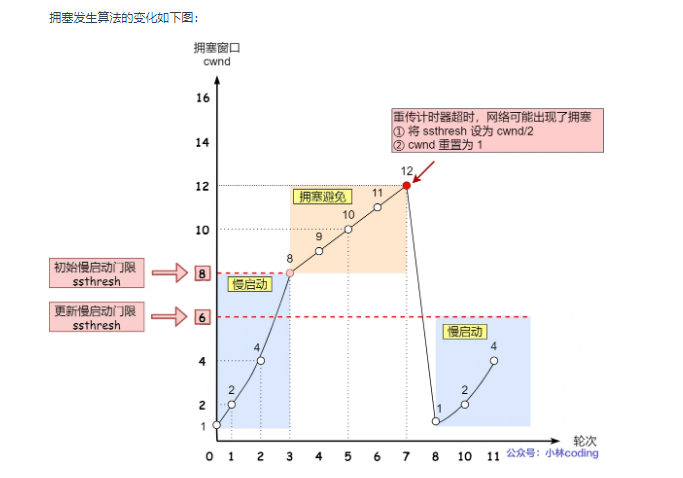
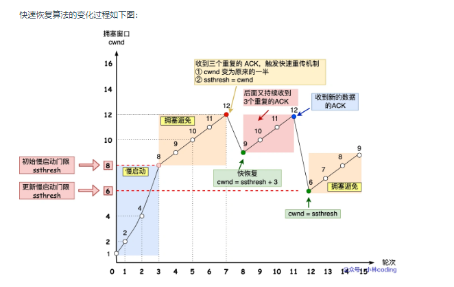

### TCP 基本认识

#### TCP 头格式有哪些？

TCP 头格式

* 序列号：在建立连接时由计算机生成的随机数作为其初始值，通过 SYN 包传给接收端主机，每发送一次数据，就「累加」一次该「数据字节数」的大小。
* 用来解决网络包乱序问题。

* 确认应答号：指下一次「期望」收到的数据的序列号，发送端收到这个确认应答以后可以认为在这个序号以前的数据都已经被正常接收。用来解决丢包的问题。

控制位：

* ACK：该位为 1 时，「确认应答」的字段变为有效，TCP 规定除了最初建立连接时的 SYN 包之外该位必须设置为 1 。
* RST：该位为 1 时，表示 TCP 连接中出现异常必须强制断开连接。
* SYN：该位为 1 时，表示希望建立连接，并在其「序列号」的字段进行序列号初始值的设定。
* FIN：该位为 1 时，表示今后不会再有数据发送，希望断开连接。当通信结束希望断开连接时，通信双方的主机之间就可以相互交换 FIN 位为 1 的 TCP 段。

#### 为什么需要 TCP 协议？ TCP 工作在哪一层？

* IP 层是「不可靠」的，它不保证网络包的交付、不保证网络包的按序交付、也不保证网络包中的数据的完整性。

如果需要保障网络数据包的可靠性，那么就需要由上层（传输层）的 TCP 协议来负责。

* 因为 TCP 是一个工作在传输层的可靠数据传输的服务，它能确保接收端接收的网络包是无损坏、无间隔、非冗余和按序的。

#### 什么是 TCP ？

TCP 是面向连接的、可靠的、基于字节流的传输层通信协议。

* 面向连接：一定是「一对一」才能连接，不能像 UDP 协议可以一个主机同时向多个主机发送消息，也就是一对多是无法做到的；

* 可靠的：无论的网络链路中出现了怎样的链路变化，TCP 都可以保证一个报文一定能够到达接收端；

* 字节流：用户消息通过 TCP 协议传输时，消息可能会被操作系统「分组」成多个的 TCP 报文，如果接收方的程序如果不知道「消息的边界」，是无法读出一个有效的用户消息的
* TCP 报文是「有序的」，当「前一个」TCP 报文没有收到的时候，即使它先收到了后面的 TCP 报文，那么也不能扔给应用层去处理，
* 同时对「重复」的 TCP 报文会自动丢弃。

#### 什么是 TCP 连接？

RFC 793 定义「连接」的：

* 用于保证可靠性和流量控制维护的某些状态信息，这些信息的组合，包括Socket、序列号和窗口大小称为连接。
  所以我们可以知道，建立一个 TCP 连接是需要客户端与服务器端达成上述三个信息的共识。

* Socket：由 IP 地址和端口号组成
* 序列号：用来解决乱序问题等
* 窗口大小：用来做流量控制

#### 如何唯一确定一个 TCP 连接呢？

TCP 四元组可以唯一的确定一个连接，四元组包括如下：

源地址
源端口
目的地址
目的端口
TCP 四元组

* 源地址和目的地址的字段（32位）是在 IP 头部中，作用是通过 IP 协议发送报文给对方主机。

* 源端口和目的端口的字段（16位）是在 TCP 头部中，作用是告诉 TCP 协议应该把报文发给哪个进程。

#### 有一个 IP 的服务器监听了一个端口，它的 TCP 的最大连接数是多少？

服务器通常固定在某个本地端口上监听，等待客户端的连接请求。
因此，客户端 IP 和 端口是可变的，其理论值计算公式如下:

* 对 IPv4，客户端的 IP 数最多为 2 的 32 次方，客户端的端口数最多为 2 的 16 次方，也就是服务端单机最大 TCP 连接数，约为 2 的 48 次方。

当然，服务端最大并发 TCP 连接数远不能达到理论上限，会受以下因素影响：

文件描述符限制，每个 TCP 连接都是一个文件，如果文件描述符被占满了，会发生 too many open files。Linux 对可打开的文件描述符的数量分别作了三个方面的限制：
系统级：当前系统可打开的最大数量，通过 cat /proc/sys/fs/file-max 查看；
用户级：指定用户可打开的最大数量，通过 cat /etc/security/limits.conf 查看；
进程级：单个进程可打开的最大数量，通过 cat /proc/sys/fs/nr_open 查看；
内存限制，每个 TCP 连接都要占用一定内存，操作系统的内存是有限的，如果内存资源被占满后，会发生 OOM。

#### UDP 和 TCP 有什么区别呢？分别的应用场景是？
UDP 不提供复杂的控制机制，利用 IP 提供面向「无连接」的通信服务。

UDP 协议真的非常简，头部只有 8 个字节（ 64 位），UDP 的头部格式如下：

UDP 头部格式

目标和源端口：主要是告诉 UDP 协议应该把报文发给哪个进程。
包长度：该字段保存了 UDP 首部的长度跟数据的长度之和。
校验和：校验和是为了提供可靠的 UDP 首部和数据而设计，防止收到在网络传输中受损的 UDP包。
####  TCP 和 UDP 区别：

* 连接
TCP 是面向连接的传输层协议，传输数据前先要建立连接。
UDP 是不需要连接，即刻传输数据。

* 服务对象
TCP 是一对一的两点服务，即一条连接只有两个端点。
UDP 支持一对一、一对多、多对多的交互通信

* 可靠性
TCP 是可靠交付数据的，数据可以无差错、不丢失、不重复、按序到达。
UDP 是尽最大努力交付，不保证可靠交付数据。

* 拥塞控制、流量控制
TCP 有拥塞控制和流量控制机制，保证数据传输的安全性。
UDP 则没有，即使网络非常拥堵了，也不会影响 UDP 的发送速率。

* 首部开销
TCP 首部长度较长，会有一定的开销，首部在没有使用「选项」字段时是 20 个字节，如果使用了「选项」字段则会变长的。
UDP 首部只有 8 个字节，并且是固定不变的，开销较小。

* 传输方式
TCP 是流式传输，没有边界，但保证顺序和可靠。
UDP 是一个包一个包的发送，是有边界的，但可能会丢包和乱序。 

* 分片不同

TCP 的数据大小如果大于 MSS 大小，则会在传输层进行分片，目标主机收到后，也同样在传输层组装 TCP 数据包，如果中途丢失了一个分片，只需要传输丢失的这个分片。
UDP 的数据大小如果大于 MTU 大小，则会在 IP 层进行分片，目标主机收到后，在 IP 层组装完数据，接着再传给传输层。
TCP 和 UDP 应用场景：

* 由于 TCP 是面向连接，能保证数据的可靠性交付，因此经常用于：

FTP 文件传输；
HTTP / HTTPS；

* 由于 UDP 面向无连接，它可以随时发送数据，再加上UDP本身的处理既简单又高效，因此经常用于：
包总量较少的通信，如 DNS 、SNMP 等；
视频、音频等多媒体通信；
广播通信；

#### 为什么 UDP 头部没有「首部长度」字段，而 TCP 头部有「首部长度」字段呢？

原因是 TCP 有可变长的**「选项」**字段，而 UDP 头部长度则是不会变化的，无需多一个字段去记录 UDP 的首部长度。

#### 为什么 UDP 头部有「包长度」字段，而 TCP 头部则没有「包长度」字段呢？

#### 先说说 TCP 是如何计算负载数据长度：


其中 IP 总长度 和 IP 首部长度，在 IP 首部格式是已知的。TCP 首部长度，则是在 TCP 首部格式已知的，所以就可以求得 TCP 数据的长度。

大家这时就奇怪了问：“ UDP 也是基于 IP 层的呀，那 UDP 的数据长度也可以通过这个公式计算呀？ 为何还要有「包长度」呢？”

这么一问，确实感觉 UDP 「包长度」是冗余的。

因为为了网络设备硬件设计和处理方便，首部长度需要是 4字节的整数倍。

如果去掉 UDP 「包长度」字段，那 UDP 首部长度就不是 4 字节的整数倍了，所以小林觉得这可能是为了补全 UDP 首部长度是 4 字节的整数倍，才补充了「包长度」字段。

### TCP 连接建立

#### 为什么是三次握手？不是两次、四次？
相信大家比较常回答的是：“因为三次握手才能保证双方具有接收和发送的能力。”

这回答是没问题，但这回答是片面的，并没有说出主要的原因。

在前面我们知道了什么是 TCP 连接：

用于保证可靠性和流量控制维护的某些状态信息，这些信息的组合，包括Socket、序列号和窗口大小称为连接。
所以，重要的是为什么三次握手才可以初始化Socket、序列号和窗口大小并建立 TCP 连接。

接下来，以三个方面分析三次握手的原因：

* 三次握手才可以阻止重复历史连接的初始化（主要原因）
* 三次握手才可以同步双方的初始序列号
* 三次握手才可以避免资源浪费
#### 原因一：避免历史连接

我们来看看 RFC 793 指出的 TCP 连接使用三次握手的首要原因：

The principle reason for the three-way handshake is to prevent old duplicate connection initiations from causing confusion.

简单来说，三次握手的首要原因是为了防止旧的重复连接初始化造成混乱。

我们考虑一个场景，客户端先发送了 SYN（seq = 90） 报文，然后客户端宕机了，而且这个 SYN 报文还被网络阻塞了，服务端并没有收到，接着客户端重启后，又重新向服务端建立连接，发送了 SYN（seq = 100） 报文（注意不是重传 SYN，重传的 SYN 的序列号是一样的）。

看看三次握手是如何阻止历史连接的：

三次握手避免历史连接

客户端连续发送多次 SYN 建立连接的报文，在网络拥堵情况下：

一个「旧 SYN 报文」比「最新的 SYN 」 报文早到达了服务端；
那么此时服务端就会回一个 SYN + ACK 报文给客户端；
客户端收到后可以根据自身的上下文，判断这是一个历史连接（序列号过期或超时），那么客户端就会发送 RST 报文给服务端，表示中止这一次连接。
如果是两次握手连接，就无法阻止历史连接，那为什么 TCP 两次握手为什么无法阻止历史连接呢？

#### 我先直接说结论，主要是因为在两次握手的情况下，「被动发起方」没有中间状态给「主动发起方」来阻止历史连接，导致「被动发起方」可能建立一个历史连接，造成资源浪费。

你想想，两次握手的情况下，「被动发起方」在收到 SYN 报文后，就进入 ESTABLISHED 状态，意味着这时可以给对方发送数据给，但是「主动发」起方此时还没有进入 ESTABLISHED 状态，假设这次是历史连接，主动发起方判断到此次连接为历史连接，那么就会回 RST 报文来断开连接，而「被动发起方」在第一次握手的时候就进入 ESTABLISHED 状态，所以它可以发送数据的，但是它并不知道这个是历史连接，它只有在收到 RST 报文后，才会断开连接。

两次握手无法阻止历史连接

可以看到，上面这种场景下，「被动发起方」在向「主动发起方」发送数据前，并没有阻止掉历史连接，导致「被动发起方」建立了一个历史连接，又白白发送了数据，妥妥地浪费了「被动发起方」的资源。

因此，要解决这种现象，最好就是在「被动发起方」发送数据前，也就是建立连接之前，要阻止掉历史连接，这样就不会造成资源浪费，而要实现这个功能，就需要三次握手。

所以，TCP 使用三次握手建立连接的最主要原因是防止「历史连接」初始化了连接。

#### 原因二：同步双方初始序列号

TCP 协议的通信双方， 都必须维护一个「序列号」， 序列号是可靠传输的一个关键因素，它的作用：

接收方可以去除重复的数据；
接收方可以根据数据包的序列号按序接收；
可以标识发送出去的数据包中， 哪些是已经被对方收到的（通过 ACK 报文中的序列号知道）；
可见，序列号在 TCP 连接中占据着非常重要的作用，所以当客户端发送携带「初始序列号」的 SYN 报文的时候，需要服务端回一个 ACK 应答报文，表示客户端的 SYN 报文已被服务端成功接收，那当服务端发送「初始序列号」给客户端的时候，依然也要得到客户端的应答回应，这样一来一回，才能确保双方的初始序列号能被可靠的同步。

四次握手与三次握手

#### 四次握手其实也能够可靠的同步双方的初始化序号，但由于第二步和第三步可以优化成一步，所以就成了「三次握手」。

而两次握手只保证了一方的初始序列号能被对方成功接收，没办法保证双方的初始序列号都能被确认接收。

#### 原因三：避免资源浪费

如果只有「两次握手」，当客户端的 SYN 请求连接在网络中阻塞，客户端没有接收到 ACK 报文，就会重新发送 SYN ，由于没有第三次握手，服务器不清楚客户端是否收到了自己发送的建立连接的 ACK 确认信号，所以每收到一个 SYN 就只能先主动建立一个连接，这会造成什么情况呢？

如果客户端的 SYN 阻塞了，重复发送多次 SYN 报文，那么服务器在收到请求后就会建立多个冗余的无效链接，造成不必要的资源浪费。

两次握手会造成资源浪费

即两次握手会造成消息滞留情况下，服务器重复接受无用的连接请求 SYN 报文，而造成重复分配资源。
#### 小结

TCP 建立连接时，通过三次握手能防止历史连接的建立，能减少双方不必要的资源开销，能帮助双方同步初始化序列号。序列号能够保证数据包不重复、不丢弃和按序传输。

不使用「两次握手」和「四次握手」的原因：

* 「两次握手」：无法防止历史连接的建立，会造成双方资源的浪费，也无法可靠的同步双方序列号；
* 「四次握手」：三次握手就已经理论上最少可靠连接建立，所以不需要使用更多的通信次数。

#### 为什么每次建立 TCP 连接时，初始化的序列号都要求不一样呢？
主要原因有两个方面：

* 为了防止历史报文被下一个相同四元组的连接接收（主要方面）；
* 为了安全性，防止黑客伪造的相同序列号的 TCP 报文被对方接收；
接下来，详细说说第一点。

假设每次建立连接，客户端和服务端的初始化序列号都是从 0 开始：

客户端和服务端建立一个 TCP 连接，在客户端发送数据包被网络阻塞了，然后超时重传了这个数据包，而此时服务端设备断电重启了，之前与客户端建立的连接就消失了，于是在收到客户端的数据包的时候就会发送 RST 报文。
紧接着，客户端又与服务端建立了与上一个连接相同四元组的连接；
在新连接建立完成后，上一个连接中被网络阻塞的数据包正好抵达了服务端，刚好该数据包的序列号正好是在服务端的接收窗口内，所以该数据包会被服务端正常接收，就会造成数据错乱。
可以看到，如果每次建立连接，客户端和服务端的初始化序列号都是一样的话，很容易出现历史报文被下一个相同四元组的连接接收的问题。

* 如果每次建立连接客户端和服务端的初始化序列号都「不一样」，就有大概率因为历史报文的序列号「不在」对方接收窗口，从而很大程度上避免了历史报文
* 相反，如果每次建立连接客户端和服务端的初始化序列号都「一样」，就有大概率遇到历史报文的序列号刚「好在」对方的接收窗口内，从而导致历史报文被新连接成功接收。

所以，每次初始化序列号不一样能够很大程度上避免历史报文被下一个相同四元组的连接接收，注意是很大程度上，并不是完全避免了（因为序列号会有回绕的问题，所以需要用时间戳的机制来判断历史报文，详细看篇：TCP 是如何避免历史报文的？ (opens new window)）。

#### 初始序列号 ISN 是如何随机产生的？
起始 ISN 是基于时钟的，每 4 微秒 + 1，转一圈要 4.55 个小时。

RFC793 提到初始化序列号 ISN 随机生成算法：ISN = M + F(localhost, localport, remotehost, remoteport)。

M 是一个计时器，这个计时器每隔 4 微秒加 1。
F 是一个 Hash 算法，根据源 IP、目的 IP、源端口、目的端口生成一个随机数值。要保证 Hash 算法不能被外部轻易推算得出，用 MD5 算法是一个比较好的选择。
可以看到，随机数是会基于时钟计时器递增的，基本不可能会随机成一样的初始化序列号。

#### 既然 IP 层会分片，为什么 TCP 层还需要 MSS 呢？
我们先来认识下 MTU 和 MSS

MTU 与 MSS

MTU：一个网络包的最大长度，以太网中一般为 1500 字节；
MSS：除去 IP 和 TCP 头部之后，一个网络包所能容纳的 TCP 数据的最大长度；
如果在 TCP 的整个报文（头部 + 数据）交给 IP 层进行分片，会有什么异常呢？

当 IP 层有一个超过 MTU 大小的数据（TCP 头部 + TCP 数据）要发送，那么 IP 层就要进行分片，把数据分片成若干片，保证每一个分片都小于 MTU。把一份 IP 数据报进行分片以后，由目标主机的 IP 层来进行重新组装后，再交给上一层 TCP 传输层。

这看起来井然有序，但这存在隐患的，那么当如果一个 IP 分片丢失，整个 IP 报文的所有分片都得重传。

因为 IP 层本身没有超时重传机制，它由传输层的 TCP 来负责超时和重传。

当接收方发现 TCP 报文（头部 + 数据）的某一片丢失后，则不会响应 ACK 给对方，那么发送方的 TCP 在超时后，就会重发「整个 TCP 报文（头部 + 数据）」。

因此，可以得知由 IP 层进行分片传输，是非常没有效率的。

所以，为了达到最佳的传输效能 TCP 协议在建立连接的时候通常要协商双方的 MSS 值，当 TCP 层发现数据超过 MSS 时，则就先会进行分片，当然由它形成的 IP 包的长度也就不会大于 MTU ，自然也就不用 IP 分片了。

握手阶段协商 MSS

经过 TCP 层分片后，如果一个 TCP 分片丢失后，进行重发时也是以 MSS 为单位，而不用重传所有的分片，大大增加了重传的效率。


#### 三次握手优化策略
#### 客户端的优化
* 当客户端发起 SYN 包时，可以通过 tcp_syn_retries 控制其重传的次数。

#### 服务端的优化
* 当服务端 SYN 半连接队列溢出后，会导致后续连接被丢弃，可以通过 netstat -s 观察半连接队列溢出的情况
* 如果 SYN 半连接队列溢出情况比较严重，可以通过 tcp_max_syn_backlog、somaxconn、backlog 参数来调整 SYN 半连接队列的大小。
* 服务端回复 SYN+ACK 的重传次数由 tcp_synack_retries 参数控制。如果遭受 SYN 攻击，应把 tcp_syncookies 参数设置为 1，表示仅在 SYN 队列满后开启 syncookie 功能，可以保证正常的连接成功建立。
* 服务端收到客户端返回的 ACK，会把连接移入 accpet 队列，等待进行调用 accpet() 函数取出连接。 
* 可以通过 ss -lnt 查看服务端进程的 accept 队列长度，如果 accept 队列溢出，系统默认丢弃 ACK，如果可以把 tcp_abort_on_overflow 设置为 1 ，表示用 RST 通知客户端连接建立失败。
* 如果 accpet 队列溢出严重，可以通过 listen 函数的 backlog 参数和 somaxconn 系统参数提高队列大小，accept 队列长度取决于 min(backlog, somaxconn)。

#### 绕过三次握手
TCP Fast Open 功能可以绕过三次握手，使得 HTTP 请求减少了 1 个 RTT 的时间，Linux 下可以通过 tcp_fastopen 开启该功能，同时必须保证服务端和客户端同时支持。


四次挥手过程只涉及了两种报文，分别是 FIN 和 ACK：
* FIN 就是结束连接的意思，谁发出 FIN 报文，就表示它将不会再发送任何数据，关闭这一方向上的传输通道；
* ACK 就是确认的意思，用来通知对方：你方的发送通道已经关闭；

#### 四次挥手的过程:

* 当主动方关闭连接时，会发送 FIN 报文，此时发送方的 TCP 连接将从 ESTABLISHED 变成 FIN_WAIT1。
* 当被动方收到 FIN 报文后，内核会自动回复 ACK 报文，连接状态将从 ESTABLISHED 变成 CLOSE_WAIT，表示被动方在等待进程调用 close 函数关闭连接。
* 当主动方收到这个 ACK 后，连接状态由 FIN_WAIT1 变为 FIN_WAIT2，也就是表示主动方的发送通道就关闭了。
* 当被动方进入 CLOSE_WAIT 时，被动方还会继续处理数据，等到进程的 read 函数返回 0 后，应用程序就会调用 close 函数，进而触发内核发送 FIN 报文，此时被动方的连接状态变为 LAST_ACK。
* 当主动方收到这个 FIN 报文后，内核会回复 ACK 报文给被动方，同时主动方的连接状态由 FIN_WAIT2 变为 TIME_WAIT，在 Linux 系统下大约等待 1 分钟后，TIME_WAIT 状态的连接才会彻底关闭。
* 当被动方收到最后的 ACK 报文后，被动方的连接就会关闭。
* 每个方向都需要一个 FIN 和一个 ACK，因此通常被称为四次挥手。
* 主动关闭连接的，才有 TIME_WAIT 状态


针对 TCP 四次挥手的优化，我们需要根据主动方和被动方四次挥手状态变化来调整系统 TCP 内核参数。
#### 四次挥手的优化策略
#### 主动方的优化
* 主动发起 FIN 报文断开连接的一方，如果迟迟没收到对方的 ACK 回复，则会重传 FIN 报文，重传的次数由 tcp_orphan_retries 参数决定。
* 当主动方收到 ACK 报文后，连接就进入 FIN_WAIT2 状态，根据关闭的方式不同，优化的方式也不同：
  如果这是 close 函数关闭的连接，那么它就是孤儿连接。如果 tcp_fin_timeout 秒内没有收到对方的 FIN 报文，连接就直接关闭。同时，为了应对孤儿连接占用太多的资源，tcp_max_orphans 定义了最大孤儿连接的数量，超过时连接就会直接释放。
  反之是 shutdown 函数关闭的连接，则不受此参数限制；
* 当主动方接收到 FIN 报文，并返回 ACK 后，主动方的连接进入 TIME_WAIT 状态。这一状态会持续 1 分钟，为了防止 TIME_WAIT 状态占用太多的资源，tcp_max_tw_buckets 定义了最大数量，超过时连接也会直接释放。
* 当 TIME_WAIT 状态过多时，还可以通过设置 tcp_tw_reuse 和 tcp_timestamps 为 1 ，将 TIME_WAIT 状态的端口复用于作为客户端的新连接，注意该参数只适用于客户端。

#### 被动方的优化
* 被动关闭的连接方应对非常简单，它在回复 ACK 后就进入了 CLOSE_WAIT 状态，等待进程调用 close 函数关闭连接。因此，出现大量 CLOSE_WAIT 状态的连接时，应当从应用程序中找问题。
当被动方发送 FIN 报文后，连接就进入 LAST_ACK 状态，在未等到 ACK 时，会在 tcp_orphan_retries 参数的控制下重发 FIN 报文

#### TCP 传输数据的性能提升
在前面介绍的是三次握手和四次挥手的优化策略，接下来主要介绍的是 TCP 传输数据时的优化策略。

TCP 连接是由内核维护的，内核会为每个连接建立内存缓冲区：

如果连接的内存配置过小，就无法充分使用网络带宽，TCP 传输效率就会降低；

如果连接的内存配置过大，很容易把服务器资源耗尽，这样就会导致新连接无法建立；

因此，我们必须理解 Linux 下 TCP 内存的用途，才能正确地配置内存大小。

滑动窗口是如何影响传输速度的？


#### TCP Keepalive 和 HTTP Keep-Alive 是一个东西吗？

#### HTTP 的 Keep-Alive

HTTP 协议采用的是「请求-应答」的模式，也就是客户端发起了请求，服务端才会返回响应，一来一回这样子。
从 HTTP 1.1 开始， 就默认是开启了 Keep-Alive，如果要关闭 Keep-Alive，需要在 HTTP 请求的包头里添加：
Connection:close
现在大多数浏览器都默认是使用 HTTP/1.1，所以 Keep-Alive 都是默认打开的。一旦客户端和服务端达成协议，那么长连接就建立好了。
HTTP 长连接不仅仅减少了 TCP 连接资源的开销，而且这给 HTTP 流水线技术提供了可实现的基础。
**所谓的 HTTP 流水线，是客户端可以先一次性发送多个请求，而在发送过程中不需先等待服务器的回应，可以减少整体的响应时间。**
举例来说，客户端需要请求两个资源。以前的做法是，在同一个 TCP 连接里面，先发送 A 请求，然后等待服务器做出回应，收到后再发出 B 请求。HTTP 流水线机制则允许客户端同时发出 A 请求和 B 请求。
**但是服务器还是按照顺序响应，先回应 A 请求，完成后再回应 B 请求。
而且要等服务器响应完客户端第一批发送的请求后，客户端才能发出下一批的请求，也就说如果服务器响应的过程发生了阻塞，那么客户端就无法发出下一批的请求，此时就造成了「队头阻塞」的问题。**
**所以为了避免资源浪费的情况，web 服务软件一般都会提供 keepalive_timeout 参数，用来指定 HTTP 长连接的超时时间。**
比如设置了 HTTP 长连接的超时时间是 60 秒，web 服务软件就会启动一个定时器，如果客户端在完后一个 HTTP 请求后，在 60 秒内都没有再发起新的请求，定时器的时间一到，就会触发回调函数来释放该连接。

#### TCP 的 Keepalive -- TCP 的保活机制

如果两端的 TCP 连接一直没有数据交互，达到了触发 TCP 保活机制的条件，那么内核里的 TCP 协议栈就会发送探测报文。
如果对端程序是正常工作的。当 TCP 保活的探测报文发送给对端, 对端会正常响应，这样 TCP 保活时间会被重置，等待下一个 TCP 保活时间的到来。
如果对端主机崩溃，或对端由于其他原因导致报文不可达。当 TCP 保活的探测报文发送给对端后，石沉大海，没有响应，连续几次，达到保活探测次数后，TCP 会报告该 TCP 连接已经死亡。
所以，TCP 保活机制可以在双方没有数据交互的情况，通过探测报文，来确定对方的 TCP 连接是否存活，这个工作是在内核完成的

### 总结

HTTP 的 Keep-Alive 也叫 HTTP 长连接，该功能是由**「应用程序」**实现的，可以使得用同一个 TCP 连接来发送和接收多个 HTTP 请求/应答，减少了 HTTP 短连接带来的多次 TCP 连接建立和释放的开销。

TCP 的 Keepalive 也叫 TCP 保活机制，该功能是由**「内核」**实现的，当客户端和服务端长达一定时间没有进行数据交互时，内核为了确保该连接是否还有效，就会发送探测报文，来检测对方是否还在线，然后来决定是否要关闭该连接。

#### 重传机制

* TCP 实现可靠传输的方式之一，是通过序列号与确认应答。

* 在 TCP 中，当发送端的数据到达接收主机时，接收端主机会返回一个确认应答消息，表示已收到消息。 所以 TCP 针对数据包丢失的情况，会用重传机制解决。

#### 常见的重传机制：

* 超时重传
* 快速重传
* SACK
* D-SACK

#### 超时重传

重传机制的其中一个方式，就是在发送数据时，设定一个定时器，当超过指定的时间后，没有收到对方的 ACK 确认应答报文，就会重发该数据，也就是我们常说的超时重传。

TCP 会在以下两种情况发生超时重传：

数据包丢失
确认应答丢失

上图中有两种超时时间不同的情况：

当超时时间 RTO 较大时，重发就慢，丢了老半天才重发，没有效率，性能差；
当超时时间 RTO 较小时，会导致可能并没有丢就重发，于是重发的就快，会增加网络拥塞，导致更多的超时，更多的超时导致更多的重发。
精确的测量超时时间 RTO 的值是非常重要的，这可让我们的重传机制更高效。

根据上述的两种情况，我们可以得知，超时重传时间 RTO 的值应该略大于报文往返 RTT 的值。

实际上「报文往返 RTT 的值」是经常变化的，因为我们的网络也是时常变化的。也就因为「报文往返 RTT 的值」 是经常波动变化的，所以「超时重传时间 RTO 的值」应该是一个动态变化的值。

我们来看看 Linux 是如何计算 RTO 的呢？

也就是每当遇到一次超时重传的时候，都会将下一次超时时间间隔设为先前值的两倍。两次超时，就说明网络环境差，不宜频繁反复发送。

超时触发重传存在的问题是，超时周期可能相对较长。那是不是可以有更快的方式呢？

于是就可以用「快速重传」机制来解决超时重发的时间等待。

#### 快速重传

* 不以时间为驱动，而是以数据驱动重传。
* 快速重传的工作方式是当收到三个相同的 ACK 报文时，会在定时器过期之前，重传丢失的报文段。

#### SACK 方法--选择性确认

* 快速重传机制只解决了一个问题，就是超时时间的问题，但是它依然面临着另外一个问题。就是重传的时候，是重传一个，还是重传所有的问题。
* 为了解决不知道该重传哪些 TCP 报文，于是就有 SACK 方法。
* TCP 头部「选项」字段里加一个 SACK 的东西，它可以将已收到的数据的信息发送给「发送方」，这样发送方就可以知道哪些数据收到了，哪些数据没收到，知道了这些信息，就可以只重传丢失的数据。
* D-SACK 有这么几个好处：

* 可以让「发送方」知道，是发出去的包丢了，还是接收方回应的 ACK 包丢了;
* 可以知道是不是「发送方」的数据包被网络延迟了;
* 可以知道网络中是不是把「发送方」的数据包给复制了;

数据包的往返时间越长，通信的效率就越低。

#### 为解决这个问题，TCP 引入了窗口这个概念。即使在往返时间较长的情况下，它也不会降低网络通信的效率。

那么有了窗口，就可以指定窗口大小，窗口大小就是指无需等待确认应答，而可以继续发送数据的最大值。

窗口的实现实际上是操作系统开辟的一个缓存空间，发送方主机在等到确认应答返回之前，必须在缓冲区中保留已发送的数据。如果按期收到确认应答，此时数据就可以从缓存区清除。

累计确认或者累计应答。

#### 窗口大小由哪一方决定？

TCP 头里有一个字段叫 Window，也就是窗口大小。

这个字段是接收端告诉发送端自己还有多少缓冲区可以接收数据。于是发送端就可以根据这个接收端的处理能力来发送数据，而不会导致接收端处理不过来。

所以，通常窗口的大小是由接收方的窗口大小来决定的。

发送方发送的数据大小不能超过接收方的窗口大小，否则接收方就无法正常接收到数据。

#### 接收窗口和发送窗口的大小是相等的吗？

并不是完全相等，接收窗口的大小是约等于发送窗口的大小的。

因为滑动窗口并不是一成不变的。比如，当接收方的应用进程读取数据的速度非常快的话，这样的话接收窗口可以很快的就空缺出来。那么新的接收窗口大小，是通过 TCP 报文中的 Windows
字段来告诉发送方。那么这个传输过程是存在时延的，所以接收窗口和发送窗口是约等于的关系

#### 流量控制

发送方不能无脑的发数据给接收方，要考虑接收方处理能力。

如果一直无脑的发数据给对方，但对方处理不过来，那么就会导致触发重发机制，从而导致网络流量的无端的浪费。

* 为了解决这种现象发生，TCP 提供一种机制可以让「发送方」根据「接收方」的实际接收能力控制发送的数据量，这就是所谓的流量控制。

#### 操作系统缓冲区与滑动窗口的关系

前面的流量控制例子，我们假定了发送窗口和接收窗口是不变的，但是实际上，发送窗口和接收窗口中所存放的字节数，都是放在操作系统内存缓冲区中的，而操作系统的缓冲区，会被操作系统调整。

当应用进程没办法及时读取缓冲区的内容时，也会对我们的缓冲区造成影响。

#### 窗口关闭

在前面我们都看到了，TCP 通过让接收方指明希望从发送方接收的数据大小（窗口大小）来进行流量控制。

如果窗口大小为 0 时，就会阻止发送方给接收方传递数据，直到窗口变为非 0 为止，这就是窗口关闭。

#### 窗口关闭潜在的危险

接收方向发送方通告窗口大小时，是通过 ACK 报文来通告的。

那么，当发生窗口关闭时，接收方处理完数据后，会向发送方通告一个窗口非 0 的 ACK 报文，如果这个通告窗口的 ACK 报文在网络中丢失了，那麻烦就大了。

**这会导致发送方一直等待接收方的非 0 窗口通知，接收方也一直等待发送方的数据，如不采取措施，这种相互等待的过程，会造成了死锁的现象。**

#### TCP 是如何解决窗口关闭时，潜在的死锁现象呢？

为了解决这个问题，TCP 为每个连接设有一个持续定时器，只要 TCP 连接一方收到对方的零窗口通知，就启动持续计时器。

如果持续计时器超时，就会发送窗口探测 ( Window probe ) 报文，而对方在确认这个探测报文时，给出自己现在的接收窗口大小。

如果接收窗口仍然为 0，那么收到这个报文的一方就会重新启动持续计时器；
如果接收窗口不是 0，那么死锁的局面就可以被打破了。
窗口探测的次数一般为 3 次，每次大约 30-60 秒（不同的实现可能会不一样）。如果 3 次过后接收窗口还是 0 的话，有的 TCP 实现就会发 RST 报文来中断连接。

#### 糊涂窗口综合症

如果接收方太忙了，来不及取走接收窗口里的数据，那么就会导致发送方的发送窗口越来越小。
到最后，如果接收方腾出几个字节并告诉发送方现在有几个字节的窗口，而发送方会义无反顾地发送这几个字节，这就是糊涂窗口综合症。
于是，要解决糊涂窗口综合症，就要同时解决上面两个问题就可以了：

* 让接收方不通告小窗口给发送方
* 让发送方避免发送小数据

#### 怎么让接收方不通告小窗口呢？

接收方通常的策略如下:

当「窗口大小」小于 min( MSS，缓存空间/2 ) ，也就是小于 MSS 与 1/2 缓存大小中的最小值时，就会向发送方通告窗口为 0，也就阻止了发送方再发数据过来。

等到接收方处理了一些数据后，窗口大小 >= MSS，或者接收方缓存空间有一半可以使用，就可以把窗口打开让发送方发送数据过来。

#### 怎么让发送方避免发送小数据呢？

发送方通常的策略如下:

使用 Nagle 算法，该算法的思路是延时处理，只有满足下面两个条件中的任意一个条件，才能可以发送数据：

条件一：要等到窗口大小 >= MSS 或是 数据大小 >= MSS；
条件二：收到之前发送数据的 ack 回包；
接收方得满足「不通告小窗口给发送方」+ 发送方开启 Nagle 算法，才能避免糊涂窗口综合症。

### 拥塞控制

为什么要有拥塞控制呀，不是有流量控制了吗？

前面的流量控制是避免「发送方」的数据填满「接收方」的缓存，但是并不知道网络的中发生了什么。

* 拥塞控制，控制的目的就是避免「发送方」的数据填满整个网络。

#### 什么是拥塞窗口？和发送窗口有什么关系呢？

* 拥塞窗口 cwnd是发送方维护的一个的状态变量，它会根据网络的拥塞程度动态变化的。

我们在前面提到过发送窗口 swnd 和接收窗口 rwnd 是约等于的关系，那么由于加入了拥塞窗口的概念后，此时发送窗口的值是swnd = min(cwnd, rwnd)，也就是拥塞窗口和接收窗口中的最小值。

拥塞窗口 cwnd 变化的规则：

只要网络中没有出现拥塞，cwnd 就会增大；
但网络中出现了拥塞，cwnd 就减少

#### 拥塞控制有哪些控制算法？

拥塞控制主要是四个算法：

* 慢启动
* 拥塞避免
* 拥塞发生
* 快速恢复

#### 慢启动

* 当发送方每收到一个 ACK，拥塞窗口 cwnd 的大小就会加 1。
* 慢启动算法，发包的个数是指数性的增长。

* 当 cwnd < ssthresh 时，使用慢启动算法。
* 当 cwnd >= ssthresh 时，就会使用「拥塞避免算法」。

#### 拥塞避免算法

当拥塞窗口 cwnd 「超过」慢启动门限 ssthresh 就会进入拥塞避免算法。

一般来说 ssthresh 的大小是 65535 字节。

* 规则是：每当收到一个 ACK 时，cwnd 增加 1/cwnd。
* 拥塞避免算法就是将原本慢启动算法的指数增长变成了线性增长，还是增长阶段，但是增长速度缓慢了一些。

当触发了重传机制，也就进入了「拥塞发生算法」。

#### 拥塞发生

当网络出现拥塞，也就是会发生数据包重传，重传机制主要有两种：

* 超时重传
* 快速重传

#### 发生超时重传的拥塞发生算法

* ssthresh 设为 cwnd/2，
  * cwnd 重置为 1 （是恢复为 cwnd 初始化值，我这里假定 cwnd 初始化值 1）
  x
#### 怎么查看系统的 cwnd 初始化值？

Linux 针对每一个 TCP 连接的 cwnd 初始化值是 10，也就是 10 个 MSS，我们可以用 ss -nli 命令查看每一个 TCP 连接的 cwnd 初始化值
```ss -nli | grep cwnd```

重新开始慢启动，慢启动是会突然减少数据流的。「超时重传」这种方式太激进了，反应也很强烈，会造成网络卡顿。
发生快速重传的拥塞发生算法

还有更好的方式，前面我们讲过「快速重传算法」。当接收方发现丢了一个中间包的时候，发送三次前一个包的 ACK，于是发送端就会快速地重传，不必等待超时再重传。

TCP 认为这种情况不严重，因为大部分没丢，只丢了一小部分，则 ssthresh 和 cwnd 变化如下：

cwnd = cwnd/2 ，也就是设置为原来的一半;
ssthresh = cwnd;
进入快速恢复算法

#### 快速恢复

快速重传和快速恢复算法一般同时使用，快速恢复算法是认为，你还能收到 3 个重复 ACK 说明网络也不那么糟糕，所以没有必要像 RTO 超时那么强烈。

正如前面所说，进入快速恢复之前，cwnd 和 ssthresh 已被更新了：

cwnd = cwnd/2 ，也就是设置为原来的一半;
ssthresh = cwnd;
然后，进入快速恢复算法如下：

拥塞窗口 cwnd = ssthresh + 3 （ 3 的意思是确认有 3 个数据包被收到了）；
重传丢失的数据包；
如果再收到重复的 ACK，那么 cwnd 增加 1；
如果收到新数据的 ACK 后，把 cwnd 设置为第一步中的 ssthresh 的值，原因是该 ACK 确认了新的数据，说明从 duplicated ACK
时的数据都已收到，该恢复过程已经结束，可以回到恢复之前的状态了，也即再次进入拥塞避免状态；
快速重传和快速恢复

也就是没有像「超时重传」一夜回到解放前，而是还在比较高的值，后续呈线性增长。

#### 快速恢复算法过程中，为什么收到新的数据后，cwnd 设置回了 ssthresh ？



在快速恢复的过程中，首先 ssthresh = cwnd/2，然后 cwnd = ssthresh + 3，表示网络可能出现了阻塞，所以需要减小 cwnd 以避免，加 3 代表快速重传时已经确认接收到了 3 个重复的数据包；
随后继续重传丢失的数据包，如果再收到重复的 ACK，那么 cwnd 增加 1。加 1 代表每个收到的重复的 ACK 包，都已经离开了网络。这个过程的目的是尽快将丢失的数据包发给目标。
如果收到新数据的 ACK 后，把 cwnd 设置为第一步中的 ssthresh 的值，恢复过程结束。

* 首先，快速恢复是拥塞发生后慢启动的优化，其首要目的仍然是降低 cwnd 来减缓拥塞，所以必然会出现 cwnd 从大到小的改变。

* 其次，过程2（cwnd逐渐加1）的存在是为了尽快将丢失的数据包发给目标，从而解决拥塞的根本问题（三次相同的 ACK 导致的快速重传），所以这一过程中 cwnd 反而是逐渐增大的。传），所以这一过程中 cwnd 反而是逐渐增大的。