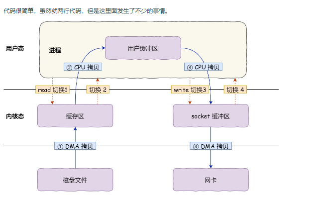

#### 计算机系统

* 进程间通信方式

* 什么时候可能产生内存泄漏
* 如何检测内存泄漏(工具)
* 内存映射
* 页面置换算法有哪些
* 为什么页表一般是4KB - 16KB
* new和malloc的区别，delete析构是谁做的，如果不调用delete会怎么样
* 举个例子说明在什么情况下内存会彻底丢掉无法找回

* 一直申请内存导致不够用会怎么样，OOM会选择哪些进程删除
-- 内存回收：
后台内存回收：在物理内存紧张的时候，会唤醒 kswapd 内核线程来回收内存，这个回收内存的过程异步的，不会阻塞进程的执行。
直接内存回收：如果后台异步回收跟不上进程内存申请的速度，就会开始直接回收，这个回收内存的过程是同步的，会阻塞进程的执行。
--oom_badness() 函数，它会把系统中可以被杀掉的进程扫描一遍，并对每个进程打分，得分最高的进程就会被首先杀掉。
* points = process_pages + oom_score_adj * totalpages / 1000
进程已经使用的物理内存页面数。
每个进程的 OOM 校准值 oom_score_adj

* malloc出来的内存一定在物理内存上分配了吗
--不是的，malloc() 分配的是虚拟内存。
  如果分配后的虚拟内存没有被访问的话，虚拟内存是不会映射到物理内存的，这样就不会占用物理内存了。
  只有在访问已分配的虚拟地址空间的时候，操作系统通过查找页表，发现虚拟内存对应的页没有在物理内存中，就会触发缺页中断，
  然后操作系统会建立虚拟内存和物理内存之间的映射关系。
* 介绍一下分页机制，缺页中断，虚拟内存和物理地址的关系

* C++代码如何变成二进制文件的，动静态链接的优缺点

* 两个二进制文件都运行同一个库文件应该怎么做

* CPU缓存机制是怎么做的，L1、2、3缓存
* linux中写文件write的流程
* 
  第一次拷贝，把磁盘上的数据拷贝到操作系统内核的缓冲区里，这个拷贝的过程是通过 DMA 搬运的。
  第二次拷贝，把内核缓冲区的数据拷贝到用户的缓冲区里，于是我们应用程序就可以使用这部分数据了，这个拷贝到过程是由 CPU 完成的。
  第三次拷贝，把刚才拷贝到用户的缓冲区里的数据，再拷贝到内核的 socket 的缓冲区里，这个过程依然还是由 CPU 搬运的。
  第四次拷贝，把内核的 socket 缓冲区里的数据，拷贝到网卡的缓冲区里，这个过程又是由 DMA 搬运的。

* 为什么开销大
* 用户态和内核态切换都做了什么
* 为什么有用户态和内核态
* 用户态和内核态的地址空间区别
--32 位系统的内核空间占用 1G，位于最高处，剩下的 3G 是用户空间；
--64 位系统的内核空间和用户空间都是 128T，分别占据整个内存空间的最高和最低处，剩下的中间部分是未定义的。
* 虚拟内存的作用
--虚拟内存可以使得进程对运行内存超过物理内存大小，因为程序运行符合局部性原理，CPU 访问内存会有很明显的重复访问的倾向性，对于那些没有被经常使用到的内存，我们可以把它换出到物理内存之外，比如硬盘上的 swap 区域。
--由于每个进程都有自己的页表，所以每个进程的虚拟内存空间就是相互独立的。进程也没有办法访问其他进程的页表，些页表是私有的，这就解决了多进程之间地址冲突的问题。
--页表里的页表项中除了物理地址之外，还有一些标记属性的比特，比如控制一个页的读写权限，标记该页是否存在等。在内存访问方面，操作系统提供了更好的安全性。
* 内存4个G，虚拟内存8个G。数据存在哪
--因为 32 位操作系统，进程最多只能申请 3 GB 大小的虚拟内存空间，所以进程申请 8GB 内存的话
在申请虚拟内存阶段就会失败（我手上没有 32 位操作系统测试，我估计失败的原因是 OOM）
--64 位操作系统，进程可以使用 128 TB 大小的虚拟内存空间，所以进程申请 8GB 内存是没问题的，因为进程申请内存是申请虚拟内存，
只要不读写这个虚拟内存，操作系统就不会分配物理内存。
  如果这块虚拟内存被访问了，要看系统有没有 Swap 分区：
  如果没有 Swap 分区，因为物理空间不够，进程会被操作系统杀掉，原因是 OOM（内存溢出）；
  如果有 Swap 分区，即使物理内存只有 4GB，程序也能正常使用 8GB 的内存，进程可以正常运行；

* 什么样的内存访问是效率最高的
--提高CPU缓存命中率
  数据缓存：是按照内存布局顺序访问
  指令缓存： 利用好CPU 自身的动态分支预测
* 如何高效利用缓存

* 缓存失效策略
--Linux 操作系统为基于 Page Cache 的读缓存机制提供预读机制，一个例子是：
应用程序只想读取磁盘上文件 A 的 offset 为 0-3KB 范围内的数据，由于磁盘的基本读写单位为 block（4KB），
于是操作系统至少会读 0-4KB 的内容，这恰好可以在一个 page 中装下。
但是操作系统出于空间局部性原理（靠近当前被访问数据的数据，在未来很大概率会被访问到），
会选择将磁盘块 offset [4KB,8KB)、[8KB,12KB) 以及 [12KB,16KB) 都加载到内存，于是额外在内存中申请了 3 个 page；
--如何避免预读失效造成的影响？
要避免预读失效带来影响，最好就是让预读页停留在内存里的时间要尽可能的短，
让真正被访问的页才移动到 LRU 链表的头部，从而保证真正被读取的热数据留在内存里的时间尽可能长。
那到底怎么才能避免呢？
Linux 操作系统和 MySQL Innodb 通过改进传统 LRU 链表来避免预读失效带来的影响，具体的改进分别如下：
Linux 操作系统实现两个了 LRU 链表：活跃 LRU 链表（active_list）和非活跃 LRU 链表（inactive_list）；
MySQL 的 Innodb 存储引擎是在一个 LRU 链表上划分来 2 个区域：young 区域 和 old 区域。
设计思想：将数据分为了冷数据和热数据，然后分别进行 LRU 算法。不再像传统的 LRU 算法那样，所有数据都只用一个 LRU 算法管理。
* 局部性原理
--
* 顺序读和随机读的区别
--
* 单例模式线程安全
--
* git中merge和rebase区别
--rebase的解释 ： rebase字面意思就是"变基"，可以直接理解为改变基底。
feature分支是基于master分支的B拉出来的分支，feature的基底是B。而master在B之后有新的提交，就相当于此时要用master上新的提交来作为feature分支的新基底。
实际操作为把B之后feature的提交存下来，然后删掉原来这些提交，再找到master的最新提交位置，把存下来的提交再接上去（新节点新commit id）
如此feature分支的基底就相当于变成了M而不是原来的B了。
注意，如果master上在B以后没有新提交，那么就还是用原来的B作为基，rebase操作相当于无效，此时和git merge就基本没区别了，
差异只在于git merge会多一条记录Merge操作的提交记录。
--推荐使用场景
* 拉公共分支最新代码的时候使用rebase，也就是git pull -r或git pull --rebase，
但有个缺点就是rebase以后我就不知道我的当前分支最早是从哪个commitid拉出来的了，因为基底变了。
（如果使用merge，多出无意义的一条提交记录"Merge … to …"）
* 往公共分支上合代码的时候，使用merge。如果使用rebase，那么其他开发人员想看主分支的历史，就不是原来的历史了，历史已经被你篡改了
* 线程和进程
* 虚拟内存
* 进程调度的状态
* 多进程与多线程，它们各自的应用场景是什么。
* 线程，线程安全，锁，CAS，问的比较细
* 数据从磁盘到CPU经过了哪些地方，什么是零拷贝


#### 计算机网络
* 输入URL解析的过程，四次挥手的过程
* TCP和UDP的区别
* TCP拥塞控制
* TCP连接建立后把网线拔了会怎么样，客户端会发生什么
* 在山区里信号很差用手机上网，没有彻底断开会发生什么，什么时候会发生重传（太难了已经崩溃了
* HTTP各个版本 (1.0，1.1，2.0，3.0)
* HTTP2.0之前怎么实现服务器推送机制
* 是否了解过Websocket
* 三次握手的过程
* 保证TCP传输的可靠性的实现
* 浏览器输入网址之后的过程
* 计算机网络五层模型
* http请求报文和响应报文包含了哪些
* https和http默认端口号是多少
* https和http区别是什么
* post请求了解吗其和get请求的区别是什么
* 流量控制与拥塞控制，它们各自的区别是什么。
* 如何使得UDP可靠传输


#### 数据库
* tcp 拥塞控制
* 问看没看过 tcp 源码，答：只看过协议首部


* tcp udp 区别
* tcp timewait 作用
* tcp 粘包拆包和解决思路
* go context 实现延时
* Redis持久化
* 为什么数据库用b+树不用红黑树
* redis中zset的底层结构
* 跳表能解决什么问题
* redis本身就是内存操作，比较快，为什么还用跳表做空间换时间
* redis为什么使用单线程
* redis的过期删除策略，定期删除和惰性删除
* 是否了解过其他数据库(除了MySQL和redis)
* 介绍MySQL索引
* 为什么使用B+树而不用B树
* B树适合什么应用场景
* 索引的最左前缀匹配
* 覆盖索引
* 索引下推
* MySQL事务隔离级别，主要解决哪些问题
* 幻读和脏读的区别
* 幻读怎么避免的 / 事务串行化怎么实现
* 数据库，MVCC了解吗 
* 索引匹配原则；
* 给了个sql和一些约束，具体不记得了，问走了索引没，为什么？又写了sql，具体不记得了，问加锁没，加了什么锁？ 
* mysql的悲观锁和乐观锁怎么实现的
* 为啥用B+树索引，B树索引有什么好处
* Hash为啥不建议做索引数据结构
* redis雪崩、穿透、击穿
* mysql相关，mvcc、索引、redolog、undolog、binlog
* Redis的zset，set，hash，list，string的底层数据结构，以及应用场景。
* 跳表原理，hash用在购物车会出现什么问题
* zset怎么使用，自己设计一个场景题使用zset
* set实现给帖子点赞如何设计key和value
* 堆排序如何实现
* 令牌桶算法了解吗
* 实现排行榜的zset指令是什么（zrangebyscore）。


#### c++
* C++虚函数，纯虚函数，虚析构函数
* C++的vector的底层实现
* 智能指针（用过，但是不太熟。直接说没怎么用）
* C++独有特性，和C的区别，描述面向对象，虚函数怎么实现，为什么需要虚函数，虚基类有接触吗
* 纯虚函数和虚函数区别，有一个大规模项目需要合作，纯虚函数有什么好处
* 函数指针和指向指针的指针是什么，有什么用
* 有哪些设计模式，单例模式是为了解决什么问题，解释一下工厂和抽象工厂
* 学过的数据结构有什么用，堆栈用处大吗，树是干什么用的，为什么要用红黑树不用其他树
* 智能指针主要解决什么问题
* 智能指针循环引用问题
* 介绍虚函数、纯虚函数
* C++的面向对象的特点
* 多态的实现形式
* 讲一讲Python语言和C++语言的区别
* Socket什么时候可读?（没有回答好）
* 构造函数是否能为虚函数，为什么。
* 动态多态。
* 静态多态?（只回答了重载，其实还有函数模板）
* 重载、重写以及隐藏各自是什么。

* 如何避免内存泄漏。
* （其实面试官想问如何定位内存泄漏，我说可以使用工具valgrind，又问如何使用这个工具定位内存泄漏，我也没用过，所以回答不上来，然后就换了一个问题）


* OS，怎么看虚拟内存，我这里也给他答了很深，把八股串起来了，面试官觉得还行。
* 问计算机网络，从浏览器输入一个url到渲染到浏览器这之间经过了哪些缓存。我答了DNS缓存，架构，以及业务代码的缓存。


### 算法题
* 递归和非递归前序遍历二叉树
* 二叉树的最大直径
* 手撕：反转链表
* 剑指 Offer 42. 连续子数组的最大和
* 124. 二叉树中的最大路径和
* 64. 最小路径和
* 算法：剑指 Offer 28. 对称的二叉树
  分析复杂度
* 算法：3. 无重复字符的最长子串
  分析复杂度及优化
* 手撕：给一个等差数列，其中有一项缺失，找出这一项
* 了解哪些排序算法，其中哪些是稳定的
* 排序的时间复杂度
* 什么排序的时间复杂度下限可以突破O(nlogn)
* 基数排序的场景
* 算法：剑指 Offer II 074. 合并区间
* 找到二叉树路径和为target的所有路径并打印出来（不一定是从根节点出发）。
* 最长回文串；全排列。
* 实现多种方式三个线程依次轮流打印ABC，打印100次；leetcode842，将数组拆分成斐波那契数列。 
* 最长回文串；
* 全排列 
* 算法题 不重复的全排列
* 算法题 1、全排列 2、岛屿数量，leetcode原题
  算法题：给一个排序数组，找众数的下标（出现次数大于等于数组长度的一半），要求O(logN)。
* 算法题：
  LeetCode 102. 二叉树的层序遍历，需要自己建树验证。
#### 其他
* 你来设计苹果iCloud共享图片是怎么做
* 平时写代码用什么东西管理
* go 垃圾回收过程
* docker 原理
 问了不了解分布式协议，答：不了解
怎么学习的linux
是否考虑怎么在KV数据库项目中加入事务
* 什么是回溯
* 有哪些搜索算法
* 什么是剪枝
* 设计模式自己有在项目中用过吗
* 日志系统为什么需要单例模式


leveldb的特点
leveldb使用场景
* 为什么不直接使用redis，而需要有本项目/RocksDB
* 项目中为什么既有epoll又有select
* 项目跨哪个平台
* 是否了解过IOCP
* IOCP和select，poll，epoll的区别
* 多路复用作用
* 项目中的多线程体现在哪里
* 为什么不把处理读写事件的多路io复用函数分散到线程中

* 项目有没有做过压测


=========HR扭转到其他组=========
* 排序两个有序链表。

part1，项目。问的很细腻，为啥用到消息队列，如果解决消息重复和消息丢失问题；
自己如何设计一个消息队列保证一个消息不会重复消费。
如何保证你的项目高可用？
项目为什么要使用N-Tree，不用有什么影响吗？
part2，基础。面试官也懂java，问了java相关。HashMap原理，扩容机制以及ConcurrentHashMap对比；HashMap如果存入元素很多会溢出吗怎么解决；volatile关键字作用以及和synchronized区别；线程池七大参数以及工作原理；阻塞队列了解过吗？（这里我答的很深，从ReentryLock到AQS那套全部说了涉及到些源码）。
死锁了解吗？谈谈死锁的必要条件？在项目中解决过死锁的问题吗？
垃圾回收算法了解吗？老年代回收担保机制是什么？
JVM对象什么时候被回收，G1垃圾回收器回收原理；G1用户自己设置停顿时间的参数是什么？
GC Roots有哪些？CMS和G1区别在哪？
算法题。算法题hard，挺难的，找到二叉树的路径和为target的所有路径并打印出来。（注意，不一定是从根节点出发）， AC。

part2，

自我介绍。问了项目不敢兴趣，直接做题。
三个线程依次轮流打印ABC，打印100次，说实话一直忙着刷高频题和记八股，这钟基础题写了半天没AC。 换道新题，将数组拆分成斐波那契数列，基本思想是回溯，但没AC。
智力题，一个卡车可以装多少个乒乓球，给个数量级。
聊天，问最近6年来自己认为最成功的事情是什么？

* 排序两个有序链表， AC。
* 智力题，问公交车15分钟来一趟，请问等5分钟等到公交车等概率是多少？我答的是使用指数分布去计算，面试官觉得还行。


抖音杭州
一面
* 口述解题思路：判断数组A是否包含于数组B；给定n对括号，返回所有合法排列

* 一个赌博网站，A时刻网站发布一个数，B时刻赌客下注，C时刻开盘。如何让赌客相信该数没有被网站修改过？

* 做题，打印出一个数组A中和等于k的整数倍的最短长度的子数组


* JVM内存暴涨，一段时间后又下降，说出排查思路和解决措施

二面
DDD的优势与缺点，微服务

spring相关问题，bean生命周期，单例，循环依赖


做题，链表截断-反转-合并，leetcode原题

挂了，转到另一个部门

一面
http、https

java锁

* 键盘输入一个字符，显示器显示出来，发生了什么

* mysql为什么用B+树，B+树为啥是m叉树不是二叉树

reentrantlock、阻塞队列，AQS底层实现

JVM内存模型、GC算法

算法题 1、全排列 2、岛屿数量，leetcode原题


* 智力题 两个人轮流投硬币，正为赢，求先投的人的胜率


二面
依然主要问项目

​ 具体业务场景，都干了啥

​ 微服务、微服务治理

​ 项目的架构、用了哪些中间件（redis、es、mq）、怎么用的，为什么

​ docker和虚拟机的区别

算法题 会议室II，leetcode原题

时间没用完，加了一个系统设计题 设计一个id生成的中间件，考虑高可用，高并发

三面
主要是聊项目，聊了二十多分钟

智力题，A和B都可能在3h内任意时刻到达，求两人到达时刻间隔小于1h的概率

算法题 二叉树最大宽度 leetcode原题


淘宝杭州
一面
自我介绍

java基础、static之类的

CAP原理

JWT

docker

线程池


其他都是常规八股文，忘了

二面
自我介绍

mysql什么时候用不到索引

hashmap和concurrenthashmap的key和value可以为null吗？为什么

如何维护不同域名的登录态

mybatis中的$和#的区别

分布式锁

reentrantlock和synchronizated的区别

项目中最大的挑战和解决办法，给自己带来什么思考和感悟

三面
redis为什么这么快，IO模型

JVM内存模型，GC算法

项目干了啥，遇到什么困难，怎么解决的

算法题：给一个排序数组，找众数的下标（出现次数大于等于数组长度的一半），要求O(logN)。


1.比赛经历相关
* new和malloc的区别
* mysql索引相关
* mysql事务
* B+树
* 三次握手，四次挥手
* 场景题

* 视频面试这种形式的网络通信，用哪种协议比较好？为什么？
* 登陆网站后，发现网站打不开，这个时候可能会是什么地方出了问题？
* 进程和线程
* 进程之间的通信
* 保证当多个线程时，数据访问安全的问题？


* 算法题：143. 重排链表


自我介绍
2.问项目
* C++11新特性
* 智能指针
* 循环引用问题及解决
* 手写shared_ptr，就大概哪些成员变量和成员函数实现
* move有了解过吗
* 给出了智能指针一段代码的用法，找错
* C++内存管理
* STL的一些容器
* 一个程序从预处理到运行经历了那些过程（详细说，编译过程中还包含词法分析、语法分析、语义分析......）
* .进程和线程的区别
* 进程和线程资源共享问题
* 死锁的概念
* 死锁产生原因
* 死锁的预防
* 死锁的避免

算法题
* 704. 二分查找
* 56. 合并区间


  
1.自我介绍
2.问项目

算法题
01背包模板题
* 剑指 Offer II 051. 节点之和最大的路径

3.写个mysql查询语句 （可能因为我说我mysql不熟所以就没有深问）
4.C++相关


首先让我自我介绍、介绍项目、问常见的C/C++基础、socket编程、计网之类的还有linux系统结构。基本上也都能回答出来

后来感觉大佬有小孩折腾有点心不在焉的样子~于是变被动为主动，掏出一个编程项目疯狂讲项目，后来大佬喊停说是后面还有同事要问问题~就问我有没有想问的问题？

必然需要问几个经典的问题：大佬现在做什么？实习过去我负责什么业务之类的？

【面试官2】

等待3、4分钟后，面试官二上线，同样自我介绍、接下来是问技术的，同样是老三样，c/c++基础、计网、数据结构之类的~

然后出了个情景题好像，说啥软件层面实现定时器？讲了MFC里面的定时器啥的，然后让我设计一个数据结构处理啥问题？不是很理解它的问题。

后来。。。。。(忘了，记不得了)

【面试官3】

挺严谨的一个大佬，打开一个ppt，里面全是英文题目、我讲完一页，他翻了一页总之基本给的题目都回答上来了~后来直接开始问红黑树了解多少，我。。。

最后问了一些场景题目，说是如何处理和同事之间的关系啥的？和别的团队合作出现矛盾怎么化解？自己的产品出现问题，客户反映这个问题应该怎么高效解决？

反问阶段：同样让介绍业务啥的~

【面试官4】


一堆C/C++的基础（经典的 small ending、big ending、sizeof()、strlen()）
从c语言到c++再到c++11新特性，以及STL

接下来就是给小姐姐讲项目了，问了两个编程项目和自己做的实验室项目~

反问阶段：问了三个问题问问自己面试有啥缺点?知识点上学习有啥不足？再就是实习结果啥时候出来之类的？实习转正之类的问题？


一面：45mins，0411，0412 通知二面
介绍实习，聊了一会
自己写的服务使用延时高如何定位
http 500状态码
如何使用 Wireshark 抓自己写的服务的数据包
都是一些应用场景题
然后问 set 怎么实现？答：拉链法
直接进入算法环节：
拉链法实现个 map
之后问给实现的 map 加上 lru 怎么加，随便答了答
下来之后自己好好写了个，看这里：https://codetop.cc/discuss/232

聊实习

还有其他的都是场景题，每个人都不一样没啥参考价值，总的来说就是有没有东西一问就问出来，幸好没露馅
面试官是主管，口头答应


个人感觉，也算是一点建议吧。不能光背八股，也要注重实践积累，有些问题真的一深问就露馅，回答问题要注意不能仅仅是回答问题，也要适当拓宽话题和抛出关键字，给面试官发挥的空间，要不然面试官随便问可有够受的。

网易有道总共面了70min，面试体验还行，比网易互娱二面好多了，最后让实现二叉树的层序遍历时，自己还需要去建立一颗二叉树是没想到的，但还是把大致思路说了一下。
1.自我介绍。
2.你所做的项目中最困难的两件事。（越是这种问题，越不好答）
3.用优先队列实现小根堆。
4.你所使用Thrift接口又有哪些。
5.枚举的定义，什么又是枚举类型。
* 说说STL常见的容器，以及各自适用的场景。
* map中的元素为什么是有序的。
* 实现一个类模板。
* 用类模板的方式去实现一个单例模式。
* 一般懒汉式存在什么问题。
* 除了单例模式还知道什么模式，各自的含义又是什么。
* c++11新特性有哪些。
* 线程同步的方式。
* 条件变量的作用，和互斥锁相比又有什么区别。


1.自我介绍。
2.在小米实习期间你的收获是什么。


设计题：

有一个图片查看器的app，服务器定时替换图片查看器中的图片，现在有两个要求：
（1）程序启动时查看图片列表。
（2）启动程序后，服务器会定时的去替换客户端的图片列表中的图片，以实现下滑。

如果是你，你会怎么实现?


* 介绍一下c++的多态
* 运行时多态与编译时多态的区别？

* c++的静态多态是怎么做到的？为什么函数名相同却可以调到不同的实现呢？

* C++ 是如何做到函数重载的？
  -C++代码在编译时会根据参数列表对函数进行重命名，例如 void Swap(int a, int b) 会被重命名为 _Swap_int_int ， void Swap(float x, float y) 会被重命名为 _
  Swap_float_float 。当发生函数调用时，编译器会根据传入的实参去逐个匹配，以选择对应的函数，如果匹配失败，编译器就会报错，这叫做 重载决议（ Overload Resolution ） 。
  -不同的编译器有不同的重命名方式，这里仅仅举例说明，实际情况可能并非如此。
  -从这个角度讲，函数重载仅仅是语法层面的，本质上它们还是不同的函数，占用不同的内存，入口地址也不一样。

* 函数返回值类型不同也能实现重载吗？
  和返回值类型无关

* 空的类是会占用内存空间的，而且大小是1，原因是C++要求每个实例在内存中都有独一无二的地址。

* 类内部的成员变量：
  普通的变量：是要占用内存的，但是要注意对齐原则（这点和struct类型很相似）。
  static修饰的静态变量：不占用内容，原因是编译器将其放在全局变量区。
* 类内部的成员函数：
  普通函数：不占用内存。
  虚函数：要占用4个字节（32位系统）或8个字节（64位系统），用来指定虚函数的虚拟函数表的入口地址。
  所以一个类的虚函数所占用的地址是不变的，和虚函数的个数是没有关系的。
* C++编译系统中，数据和函数是分开存放的(函数放在代码区；数据主要放在栈区和堆区，静态/全局区以及文字常量区也有)，
  实例化不同对象时，只给数据分配空间，各个对象调用函数时都都跳转到(内联函数例外)找到函数在代码区的入口执行，可以节省拷贝多份代码的空间
  类的静态成员变量编译时被分配到静态/全局区，因此静态成员变量是属于类的，所有对象共用一份，不计入类的内存空间。
  内联函数(声明和定义都要加inline)也是存放在代码区，内联函数在被调用时，编译器会用内联函数的代码替换掉函数，避免了函数跳转和保护现场的开销。不要将成员函数的这种存储方式和inline(内联)函数的概念混淆。不要误以为用inline声明(或默认为inline)的成员函数，其代码段占用对象的存储空间，而不用inline声明的成员函数，其代码段不占用对象的存储空间。不论是否用inline声明(或默认为inline)，成员函数的代码段都不占用对象的存储空间。用inline声明的作用是在调用该函数时，将函数的代码段复制插人到函数调用点，而若不用inline声明，在调用该函数时，流程转去函数代码段的入口地址，在执行完该函数代码段后，流程返回函数调用点。inline与成员函数是否占用对象的存储空间无关

同一个类创建的多个对象，其数据成员是各用各的，互不相通（静态成员变量是共享的）。
成员函数是共享共用的，多个对象共用一份代码，所有类成员函数和非成员函数代码存放在代码区。
不论成员函数在类内定义还是在类外定义，成员函数的代码段都用同一种方式存储。

* 两个一模一样的函数，一个使用const修饰，一个不使用const修饰，这两个函数可以进行重载吗？

* const修饰函数起到了什么作用？哪些变量不能修

* const除了修饰函数，还可以修饰什么？

* 顶层const和底层const的区别

* 指针和引用有什么区别？

* 对同一个变量的指针和引用进行sizeof操作，会有什么区别吗？

* 指针为什么会是4个字节，一定是4个字节吗？对指针做sizeof的结果与什么相关？
* 子类的大小是本身成员变量的大小加上父类的大小

* 在32位系统分配指针大小为4字节

* 继续回到动态多态，构造函数可以是virtual吗？为什么不可以是virtual？
-必要性分析：
  当定义派生类对象时，它会主动依次调用构造函数，顺序为基类的构造函数->一级派生类构造函数->二级派生类构造函数….直到当前派生类的构造函数调用完毕为止，到此派生类对象生成。
  而虚函数存在的意义为动态绑定，从上一段话可知，它会从基类开始依次自动调用相应的构造函数，根本就不存在动态绑定的必要。
-内存角度分析：
  构造函数的作用是生成相应的类对象。虚函数的动态绑定是依据一张虚函数表来确认的最终绑定到哪一个虚函数版本。
  而调用构造函数之前，我们对类对象所做的操作仅限于分配内存，还没有对内存进行初始化。此时，内存空间上也不存在虚函数表，
  因此，按照这样的执行顺序，虚函数的动态绑定是实现不了的

```c++
#include <iostream>
using namespace std;

class Father
{
  public:
    Father(){
        cout<<"contructor Father!"<<endl;
    }
    ~Father(){
        cout<<"destructor Father!"<<endl;
    }
};

class Son:public Father
{
  public:
    Son(){
        cout<<"contructor Son!"<<endl;
    }
    ~Son(){
        cout<<"destructor Son!"<<endl;
    }
};

int main()
{
    Father *pfather=new Son;
    delete pfather;
    pfather=NULL;
    return 0;
}
/*输出结果为：
contructor Father!
contructor Son!
destructor Father!
*/
```

13、虚表指针是什么时候初始化的？

*
* 不考虑使用场景，除了构造函数，给所有函数都声明为virtual的，可以这样做吗？或者推荐这么做吗？有什么负面影响吗？

- 虚函数不同于普通成员函数，当类中有虚成员函数时，类会自动进行一些额外工作。
  这些额外的工作包括生成虚函数表和虚表指针，虚表指针指向虚函数表。每个类都有自己的虚函数表，虚函数表的作用就是保存本类中虚函数的地址，
  我们可以把虚函数表形象地看成一个数组，这个数组的每个元素存放的就是各个虚函数的地址。
  这样一来，就会占用额外的内存，当们定义的类不被其他类继承时，这种内存开销无疑是浪费的。
-

* 介绍一下static关键字都有什么作用？都可以修饰什么？分别起到什么作用呢？function实现里面对一个局部变量定义static可以吗？
* c++单例模式，都有哪些实现？预加载和延迟加载各自都有什么问题？都存在安全问题吗？
* 预先加载有什么缺点吗？
* 有两个使用预先加载的单例类，一个类A一个类B，类B的初始化依赖于类A的初始化完成，使用预先加载的方式可以保证能够完成吗？类A类B在两个不同的文件里面（c++对不同文件（编译单元）里面定义的static变量初始化的顺序有保证吗？）不能够做到的话，这种情况知道怎么解决吗？
* 在一个函数内部定义一个static变量，不对其进行加锁，有线程安全的保证吗？c++11以前没有，c++11以后有了，通过c++11语言标准进行保证的。
* c++11里面用到了哪些东西？
* 引用坍缩的概念有了解吗？（指的就是forward解决的问题，右值引用变成左值的情况）
* 智能指针用过哪些？
* unique_ptr有哪些特性？
24、shared_ptr有哪些特性？
25、shared_ptr保证线程安全吗？为什么不是线程安全的？

* vector的扩容过程？
-- 当向vector中插入元素时，如果元素有效个数size与空间容量capacity相等时，vector内部会触发扩容机制：

* 有什么方法能够避免vector的动态扩容过程呢？
-- 如果要避免扩容而导致程序效率过低问题，其实非常简单：如果在插入之前，可以预估vector存储元素的个数，提前将底层容量开辟好即可
-- 如果插入之前进行reserve，只要空间给足，则插入时不会扩容，如果没有reserve，则会边插入边扩容，效率极其低下。

* 虚基类的作用 --菱形继承

* 移动构造函数的优点
--移动构造函数是c++11的新特性，移动构造函数传入的参数是一个右值 用&&标出。
--首先讲讲拷贝构造函数：拷贝构造函数是先将传入的参数对象进行一次深拷贝，再传给新对象。这就会有一次拷贝对象的开销，并且进行了深拷贝，就需要给对象分配地址空间

* 而移动构造函数就是为了解决这个拷贝开销而产生的。移动构造函数首先将传递参数的内存地址空间接管，然后将内部所有指针设置为nullptr，并且在原地址上进行新对象的构造，最后调用原对象的的析构函数，这样做既不会产生额外的拷贝开销，也不会给新对象分配内存空间。
```c++
    Str(const Str &s) {
      cout<<"拷贝构造函数..."<<endl;
      str = NULL;
      int len = strlen(s.str);
      str = (char *)malloc(len + 1);
      memset(str,0,len + 1);
      strcpy(str,s.str);
    }
    demo(const demo &d):num(new int(*d.num)) {
      cout<<"copy construct!"<<endl;
    }
    Str(Str &&s) {
      cout<<"移动构造函数..."<<endl;
      str = NULL;
      str = s.str;
      s.str = NULL;
    }
    //添加移动构造函数
    demo(demo &&d):num(d.num) {
      d.num = NULL;
      cout<<"move construct!"<<endl;
    }
    A(A&x) {
      this->num = new int(*x.num);
      cout << "拷贝构造函数" << endl;
    }
    A(A&&x) {
      this->num = x.num;
      x.num = nullptr;
      cout << "移动构造函数" << endl;
    }
     
```
* 线程安全的单例模式
-
* 从C++源文件到可执行程序有几步


#### 第二部分：操作系统
* 进程和线程有什么区别？

* 哪些资源是线程独占的？

* 线程死循环会导致所在进程（单线程进程和多线程进程）出现什么问题，有什么影响？出现假死现象（一定会出现假死吗？）
CPU会飙升吗？
* 线程崩溃会导致进程崩溃吗？一定会导致进程崩溃吗？

* 线程崩溃之后会使用什么方式通知进程呢？

* fork()之前创建的socket，父子进程能否同时读/写此socket？
  fork()创建的socket，父子进程可以同时读/写此socket，父子进程会轮流获得socket读/写权，这点好像和1）冲突，需要详细研究内因。

第三部分：计算机网络

* TCP、UDP可以绑定相同的端口吗？
  -TCP 和 UDP 传输协议，在内核中是由两个完全独立的软件模块实现的。当主机收到数据包后，可以在 IP 包头的「协议号」字段知道该数据包是 TCP/UDP
  -所以可以根据这个信息确定送给哪个模块（TCP/UDP）处理，送给 TCP/UDP 模块的报文根据「端口号」确定送给哪个应用程序处理。
  -因此，TCP/UDP 各自的端口号也相互独立，互不影响。

* 多个TCP进程可以绑定同一个端口吗？
  如果两个 TCP 服务进程同时绑定的 IP 地址和端口都相同，那么执行 bind() 时候就会出错，错误是“Address already in use”。
  如果两个 TCP 服务进程绑定的端口都相同，而 IP 地址不同，那么执行 bind() 不会出错。

* 什么情况下，可以重新利用这个端口？

* 如何解决服务端重启时，报错“Address already in use”的问题？
  当我们重启 TCP 服务进程的时候，意味着通过服务器端发起了关闭连接操作，于是就会经过四次挥手，而对于主动关闭方，会在 TIME_WAIT 这个状态里停留一段时间，这个时间大约为 2MSL。
  当 TCP 服务进程重启时，服务端会出现 TIME_WAIT 状态的连接，TIME_WAIT 状态的连接使用的 IP+PORT 仍然被认为是一个有效的 IP+PORT 组合，相同机器上不能够在该 IP+PORT 组合上进行绑定，那么执行
  bind() 函数的时候，就会返回了 Address already in use 的错误。
  要解决这个问题，我们可以对 socket 设置 SO_REUSEADDR 属性。
  这样即使存在一个和绑定 IP+PORT 一样的 TIME_WAIT 状态的连接，依然可以正常绑定成功，因此可以正常重启成功。

* 如果没有开启 net.ipv4.tcp_tw_reuse 内核参数，那么内核就会选择下一个端口，然后继续判断，直到找到一个没有被相同四元组的连接使用的端口
* 如果端口资源耗尽还是没找到，那么 connect 函数就会返回错误。
  如果开启了 net.ipv4.tcp_tw_reuse 内核参数，就会判断该四元组的连接状态是否处于 TIME_WAIT 状态，如果连接处于 TIME_WAIT 状态并且该状态持续的时间超过了 1 秒，
* 那么就会重用该连接，于是就可以使用 2222 端口了，这时 connect 就会返回成功。
  再次提醒一次**，开启了 net.ipv4.tcp_tw_reuse 内核参数，是客户端（连接发起方） 在调用 connect() 函数时才起作用**，所以在服务端开启这个参数是没有效果的。

* 客户端的端口可以重复使用吗？
  -在客户端执行 connect 函数的时候，只要客户端连接的服务器不是同一个，内核允许端口重复使用。
  -TCP 连接是由四元组（源IP地址，源端口，目的IP地址，目的端口）唯一确认的，那么只要四元组中其中一个元素发生了变化，那么就表示不同的 TCP 连接的。
  -所以，如果客户端已使用端口 64992 与服务端 A 建立了连接，那么客户端要与服务端 B 建立连接，还是可以使用端口 64992 的，因为内核是通过四元祖信息来定位一个 TCP
  连接的，并不会因为客户端的端口号相同，而导致连接冲突的问题。

* 客户端 TCP 连接 TIME_WAIT 状态过多，会导致端口资源耗尽而无法建立新的连接吗？
  -要看客户端是否都是与同一个服务器（目标地址和目标端口一样）建立连接。
  -如果客户端都是与同一个服务器（目标地址和目标端口一样）建立连接，那么如果客户端 TIME_WAIT
  状态的连接过多，当端口资源被耗尽，就无法与这个服务器再建立连接了。即使在这种状态下，还是可以与其他服务器建立连接的，只要客户端连接的服务器不是同一个，那么端口是重复使用的。

* 如何解决客户端 TCP 连接 TIME_WAIT 过多，导致无法与同一个服务器建立连接的问题？
  -打开 net.ipv4.tcp_tw_reuse 这个内核参数。
  -因为开启了这个内核参数后，客户端调用 connect 函数时，如果选择到的端口，已经被相同四元组的连接占用的时候，就会判断该连接是否处于 TIME_WAIT 状态。
  -如果该连接处于 TIME_WAIT 状态并且 TIME_WAIT 状态持续的时间超过了 1 秒，那么就会重用这个连接，然后就可以正常使用该端口了。

* 介绍一下time_wait是一个什么状态，为什么需要这个状态，有什么作用？

* time_wait状态会带来什么副作用吗？
--如果客户端（发起连接方）的 TIME_WAIT 状态过多，占满了所有端口资源
--那么就无法对「目的 IP+ 目的 PORT」都一样的服务器发起连接了，但是被使用的端口，还是可以继续对另外一个服务器发起连接的。

* 但是 TIME_WAIT 状态也不是摆设作用，它的作用有两个：
--防止具有相同四元组的旧数据包被收到，也就是防止历史连接中的数据，被后面的连接接受，否则就会导致后面的连接收到一个无效的数据，
--保证「被动关闭连接」的一方能被正确的关闭，即保证最后的 ACK 能让被动关闭方接收，从而帮助其正常关闭;

* Linux 操作系统提供了两个可以系统参数来快速回收处于 TIME_WAIT 状态的连接，这两个参数都是默认关闭的：
* net.ipv4.tcp_tw_reuse
--如果开启该选项的话，客户端（连接发起方） 在调用 connect() 函数时，如果内核选择到的端口，已经被相同四元组的连接占用的时候 
--就会判断该连接是否处于 TIME_WAIT 状态，如果该连接处于 TIME_WAIT 状态并且 TIME_WAIT 状态持续的时间超过了 1 秒，那么就会重用这个连接，然后就可以正常使用该端口了。
--所以该选项只适用于连接发起方。
* net.ipv4.tcp_tw_recycle
--如果开启该选项的话，允许处于 TIME_WAIT 状态的连接被快速回收；
--要使得这两个选项生效，有一个前提条件，就是要打开 TCP 时间戳，即 net.ipv4.tcp_timestamps=1（默认即为 1)）。
* 同步IO和异步IO介绍一下？

* PAWS
--PAWS 就是为了避免这个问题而产生的，在开启 tcp_timestamps 选项情况下，一台机器发的所有 TCP 包都会带上发送时的时间戳，
--PAWS 要求连接双方维护最近一次收到的数据包的时间戳（Recent TSval），每收到一个新数据包都会读取数据包中的时间戳值跟 Recent TSval 值做比较，
--如果发现收到的数据包中时间戳不是递增的，则表示该数据包是过期的，就会直接丢弃这个数据包。

* 那什么是 per-host 的 PAWS 机制呢？

per-host 是对「对端 IP 做 PAWS 检查」，而非对「IP + 端口」四元组做 PAWS 检查。

但是如果客户端网络环境是用了 NAT 网关，那么客户端环境的每一台机器通过 NAT 网关后，都会是相同的 IP 地址，在服务端看来，就好像只是在跟一个客户端打交道一样，无法区分出来。

Per-host PAWS 机制利用TCP option里的 timestamp 字段的增长来判断串扰数据，而 timestamp 是根据客户端各自的 CPU tick 得出的值。

当客户端 A 通过 NAT 网关和服务器建立 TCP 连接，然后服务器主动关闭并且快速回收 TIME-WAIT 状态的连接后
客户端 B 也通过 NAT 网关和服务器建立 TCP 连接，注意客户端 A 和 客户端 B 因为经过相同的 NAT 网关，
所以是用相同的 IP 地址与服务端建立 TCP 连接，如果客户端 B 的 timestamp 比 客户端 A 的 timestamp 小，
那么由于服务端的 per-host 的 PAWS 机制的作用，服务端就会丢弃客户端主机 B 发来的 SYN 包。

因此，tcp_tw_recycle 在使用了 NAT 的网络下是存在问题的，
如果它是对 TCP 四元组做 PAWS 检查，而不是对「相同的 IP 做 PAWS 检查」，那么就不会存在这个问题了。

tcp_tw_recycle 在 Linux 4.12 版本后，直接取消了这一参数。

#### accpet 队列满了
在 TCP 三次握手的时候，Linux 内核会维护两个队列，分别是：

半连接队列，也称 SYN 队列；
全连接队列，也称 accepet 队列；
服务端收到客户端发起的 SYN 请求后，内核会把该连接存储到半连接队列
并向客户端响应 SYN+ACK，接着客户端会返回 ACK，服务端收到第三次握手的 ACK 后，内核会把连接从半连接队列移除
然后创建新的完全的连接，并将其添加到 accept 队列，等待进程调用 accept 函数时把连接取出来。
#### 半连接队列满了
当服务器造成syn攻击，就有可能导致 TCP 半连接队列满了，这时后面来的 syn 包都会被丢弃。

但是，如果开启了syncookies 功能，即使半连接队列满了，也不会丢弃syn 包。

syncookies 是这么做的：服务器根据当前状态计算出一个值，放在己方发出的 SYN+ACK 报文中发出，当客户端返回 ACK 报文时，取出该值验证，如果合法，就认为连接建立成功，如下图所示。

syncookies 参数主要有以下三个值：

0 值，表示关闭该功能；
1 值，表示仅当 SYN 半连接队列放不下时，再启用它；
2 值，表示无条件开启功能；
那么在应对 SYN 攻击时，只需要设置为 1 即可：


#### 这里给出几种防御 SYN 攻击的方法：

* 增大半连接队列；
* 开启 tcp_syncookies 功能
* 减少 SYN+ACK 重传次数
方式一：增大半连接队列

要想增大半连接队列，我们得知不能只单纯增大 tcp_max_syn_backlog 的值，还需一同增大 somaxconn 和 backlog，也就是增大全连接队列。否则，只单纯增大 tcp_max_syn_backlog 是无效的。
增大 tcp_max_syn_backlog 和 somaxconn 的方法是修改 Linux 内核参数：
增大 backlog 的方式，每个 Web 服务都不同，比如 Nginx 增大 backlog 的方法如下：
最后，改变了如上这些参数后，要重启 Nginx 服务，因为半连接队列和全连接队列都是在 listen() 初始化的。

方式二：开启 tcp_syncookies 功能

开启 tcp_syncookies 功能的方式也很简单，修改 Linux 内核参数：

方式三：减少 SYN+ACK 重传次数

当服务端受到 SYN 攻击时，就会有大量处于 SYN_REVC 状态的 TCP 连接，处于这个状态的 TCP 会重传 SYN+ACK ，当重传超过次数达到上限后，就会断开连接。

那么针对 SYN 攻击的场景，我们可以减少 SYN+ACK 的重传次数，以加快处于 SYN_REVC 状态的 TCP 连接断开。


#### 全连接队列满了
在服务端并发处理大量请求时，如果 TCP accpet 队列过小，或者应用程序调用 accept() 不及时，就会造成 accpet 队列满了 
这时后续的连接就会被丢弃，这样就会出现服务端请求数量上不去的现象。


我们可以通过 ss 命令来看 accpet 队列大小，在「LISTEN 状态」时，Recv-Q/Send-Q 表示的含义如下：


Recv-Q：当前 accpet 队列的大小，也就是当前已完成三次握手并等待服务端 accept() 的 TCP 连接个数；
Send-Q：当前 accpet 最大队列长度，上面的输出结果说明监听 8088 端口的 TCP 服务进程，accpet 队列的最大长度为 128；
如果 Recv-Q 的大小超过 Send-Q，就说明发生了 accpet 队列满的情况。

要解决这个问题，我们可以：

调大 accpet 队列的最大长度，调大的方式是通过调大 backlog 以及 somaxconn 参数。
检查系统或者代码为什么调用 accept() 不及时；


做题：
LeetCode：剑指offerⅡ76
LeetCode：剑指offer 35
